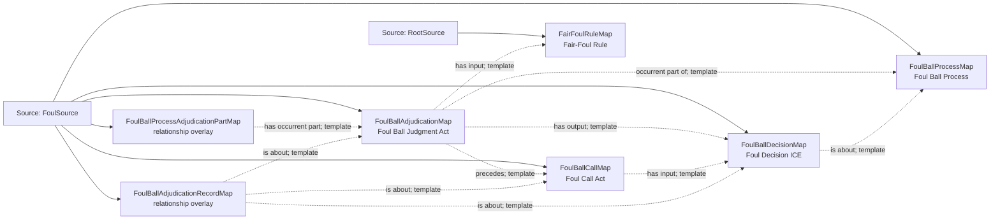

<!-- Generated by scripts/generate_rml_mermaid.py; do not edit. -->
<!-- Mapping SHA-256: ca2bfcd3533f154819be7138ce97981ad9af101d0152bc154d5eac8049dde31a -->

# Foul-ball adjudication - MLB direct RML

The foul-ball process contains a distinct judgment that uses the fair/foul rule, produces a decision, and precedes a call act.

Solid relation arrows are explicit parent-triples-map joins. Dotted relation arrows are IRI-template matches inferred by the reviewer from the actual RML templates. Cross-pattern targets are listed in the table rather than drawn, keeping the diagram small.

## Logical sources

| Source | Execution file | JSONPath iterator | Maps in this review |
| --- | --- | --- | ---: |
| `FoulSource` | `game-context.json` | `$.liveData.plays.allPlays[*].playEvents[?(@.isPitch == true && @.details.call.code == 'F')]` | 6 |
| `RootSource` | `game.json` | `$` | 1 |

## Triples maps

| Triples map | Subject class | Emitted relations | Cross-pattern targets |
| --- | --- | --- | --- |
| `FoulBallProcessMap` | Foul Ball Process | occurrent part of, occurs at, preceded by | occurrent part of -> Plate Appearance (template), occurs at -> Baseball Field (template), preceded by -> BattedBallMotionMap (template) |
| `FoulBallProcessAdjudicationPartMap` | relationship overlay | has occurrent part | none |
| `FoulBallAdjudicationMap` | Foul Ball Judgment Act | has input, has output, occurrent part of, precedes | none |
| `FoulBallDecisionMap` | Foul Decision ICE | is about | none |
| `FoulBallCallMap` | Foul Call Act | has input, occurrent part of | occurrent part of -> Plate Appearance (template) |
| `FoulBallAdjudicationRecordMap` | relationship overlay | is about | none |
| `FairFoulRuleMap` | Fair-Foul Rule | type assertion only | none |
