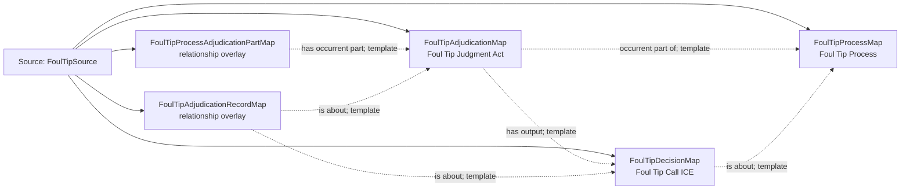

<!-- Generated by scripts/generate_rml_mermaid.py; do not edit. -->
<!-- Mapping SHA-256: a288d8d9e8e638468897751f8eda557afe2f40c2d055fa2acb378682b778531d -->

# Foul-tip adjudication - MLB direct RML

The foul-tip process contains a distinct judgment and decision while the event record remains about the adjudication evidence.

Solid relation arrows are explicit parent-triples-map joins. Dotted relation arrows are IRI-template matches inferred by the reviewer from the actual RML templates. Cross-pattern targets are listed in the table rather than drawn, keeping the diagram small.

## Logical sources

| Source | JSONPath iterator | Maps in this review |
| --- | --- | ---: |
| `FoulTipSource` | `$.liveData.plays.allPlays[*].playEvents[?(@.isPitch == true && @.details.call.code == 'T')]` | 5 |

## Triples maps

| Triples map | Subject class | Emitted relations | Cross-pattern targets |
| --- | --- | --- | --- |
| `FoulTipProcessMap` | Foul Tip Process | occurrent part of, occurs at, preceded by | occurrent part of -> PlateAppearanceMap (join), occurs at -> Baseball Field (template), preceded by -> FoulTipBallCatchingMap (template) |
| `FoulTipProcessAdjudicationPartMap` | relationship overlay | has occurrent part | none |
| `FoulTipAdjudicationMap` | Foul Tip Judgment Act | has input, has output, occurrent part of | has input -> StrikeRuleMap (template) |
| `FoulTipDecisionMap` | Foul Tip Call ICE | is about | none |
| `FoulTipAdjudicationRecordMap` | relationship overlay | is about | none |
