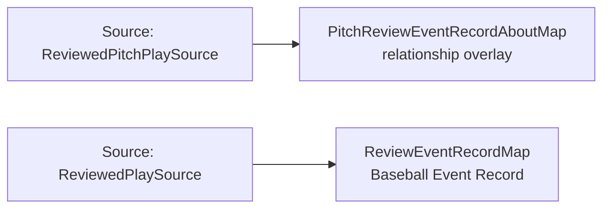

<!-- Generated by scripts/generate_rml_mermaid.py; do not edit. -->
<!-- Mapping SHA-256: bc17e2b9f57294d3456d628659686c0b73a95287999ec6cb26d7fb99be7f00f7 -->

# Replay review provenance - MLB direct RML

A review event record preserves MLB's review type and disposition, describes the final play judgment, and links pitch-result reviews to the final pitch.

Solid relation arrows are explicit parent-triples-map joins. Dotted relation arrows are IRI-template matches inferred by the reviewer from the actual RML templates. Cross-pattern targets are listed in the table rather than drawn, keeping the diagram small.

## Logical sources

| Source | Execution file | JSONPath iterator | Maps in this review |
| --- | --- | --- | ---: |
| `ReviewedPitchPlaySource` | `game-context.json` | `$.liveData.plays.allPlays[?(@._baseballO.reviewType == 'pitch_result')]` | 1 |
| `ReviewedPlaySource` | `game-context.json` | `$.liveData.plays.allPlays[?(@._baseballO.reviewStatus)]` | 1 |

## Triples maps

| Triples map | Subject class | Emitted relations | Cross-pattern targets |
| --- | --- | --- | --- |
| `ReviewEventRecordMap` | Baseball Event Record | has text value, identifier, is about, type | is about -> BalkResultJudgmentOverlayMap (template) |
| `PitchReviewEventRecordAboutMap` | relationship overlay | is about | is about -> Pitch (template) |
