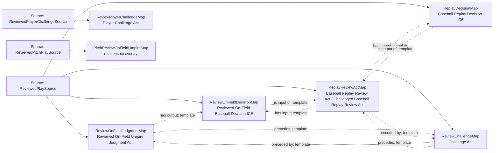

<!-- Generated by scripts/generate_rml_mermaid.py; do not edit. -->
<!-- Mapping SHA-256: ca2bfcd3533f154819be7138ce97981ad9af101d0152bc154d5eac8049dde31a -->

# Replay review core - MLB direct RML

A reviewed on-field judgment produces the prior decision, precedes a challenge, and leads to a distinct replay-review act that produces a replay decision.

Solid relation arrows are explicit parent-triples-map joins. Dotted relation arrows are IRI-template matches inferred by the reviewer from the actual RML templates. Cross-pattern targets are listed in the table rather than drawn, keeping the diagram small.

## Logical sources

| Source | Execution file | JSONPath iterator | Maps in this review |
| --- | --- | --- | ---: |
| `ReviewedPitchPlaySource` | `game-context.json` | `$.liveData.plays.allPlays[?(@._baseballO.reviewType == 'pitch_result')]` | 1 |
| `ReviewedPlaySource` | `game-context.json` | `$.liveData.plays.allPlays[?(@._baseballO.reviewStatus)]` | 5 |
| `ReviewedPlayerChallengeSource` | `game-context.json` | `$.liveData.plays.allPlays[?(@._baseballO.reviewChallengerId)]` | 1 |

## Triples maps

| Triples map | Subject class | Emitted relations | Cross-pattern targets |
| --- | --- | --- | --- |
| `ReviewOnFieldJudgmentMap` | Reviewed On-Field Umpire Judgment Act | has output, occurrent part of, precedes | occurrent part of -> ReviewOnFieldAdjudicatedProcessMap (template) |
| `ReviewOnFieldDecisionMap` | Reviewed On-Field Baseball Decision ICE | is about, is input of | is about -> ReviewOnFieldAdjudicatedProcessMap (template) |
| `ReviewChallengeMap` | Challenge Act | preceded by, precedes | none |
| `ReviewPlayerChallengeMap` | Player Challenge Act | has participant | has participant -> Player (template) |
| `PitchReviewOnFieldUmpireMap` | relationship overlay | has participant, realizes | has participant -> Person (template), realizes -> Umpire (template) |
| `ReplayReviewActMap` | Baseball Replay Review Act, Challenged Baseball Replay Review Act | has input, has output, occurrent part of, preceded by, precedes | occurrent part of -> ReplayAdjudicatedProcessMap (template), precedes -> BalkResultJudgmentOverlayMap (template) |
| `ReplayDecisionMap` | Baseball Replay Decision ICE | is about, is output of | is about -> ReplayAdjudicatedProcessMap (template) |
