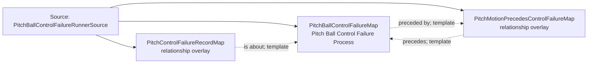

<!-- Generated by scripts/generate_rml_mermaid.py; do not edit. -->
<!-- Mapping SHA-256: 57a5cb1a54e46ee26b27f101cb1468292932df060b1f72c51331c0d029f8c2b5 -->

# Pitch-ball control failure - MLB direct RML

A pitch-ball motion precedes a distinct physical control failure that involves the same Baseball and may cause source-reported baserunning acts without entailing a scoring classification.

Solid relation arrows are explicit parent-triples-map joins. Dotted relation arrows are IRI-template matches inferred by the reviewer from the actual RML templates. Cross-pattern targets are listed in the table rather than drawn, keeping the diagram small.

## Logical sources

| Source | Execution file | JSONPath iterator | Maps in this review |
| --- | --- | --- | ---: |
| `PitchBallControlFailureRunnerSource` | `game-context.json` | `$.liveData.plays.allPlays[*].runners[?(@.details.eventType == 'passed_ball' \|\| @.details.eventType == 'wild_pitch')]` | 3 |

## Triples maps

| Triples map | Subject class | Emitted relations | Cross-pattern targets |
| --- | --- | --- | --- |
| `PitchBallControlFailureMap` | Pitch Ball Control Failure Process | has participant, is cause of, occurrent part of, occurs at, preceded by | has participant -> Baseball (template), is cause of -> CaughtStealingAttemptOverlayMap (template), occurrent part of -> Plate Appearance (template), occurs at -> Baseball Field (template) |
| `PitchMotionPrecedesControlFailureMap` | relationship overlay | precedes | none |
| `PitchControlFailureRecordMap` | relationship overlay | is about | none |
