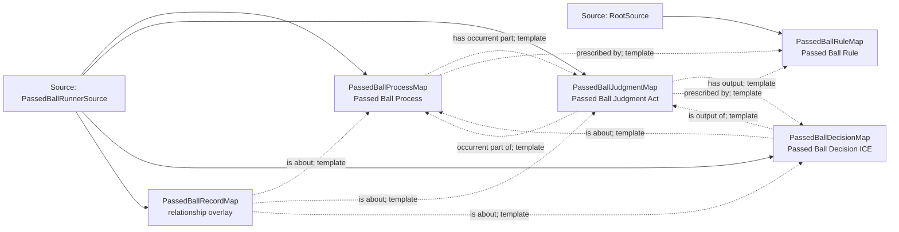

<!-- Generated by scripts/generate_rml_mermaid.py; do not edit. -->
<!-- Mapping SHA-256: 57a5cb1a54e46ee26b27f101cb1468292932df060b1f72c51331c0d029f8c2b5 -->

# Passed-ball scoring classification - MLB direct RML

A passed ball is a scorer judgment, decision, rule, and counted process downstream of a distinct physical pitch-ball control failure.

Solid relation arrows are explicit parent-triples-map joins. Dotted relation arrows are IRI-template matches inferred by the reviewer from the actual RML templates. Cross-pattern targets are listed in the table rather than drawn, keeping the diagram small.

## Logical sources

| Source | Execution file | JSONPath iterator | Maps in this review |
| --- | --- | --- | ---: |
| `PassedBallRunnerSource` | `game-context.json` | `$.liveData.plays.allPlays[*].runners[?(@.details.eventType == 'passed_ball')]` | 4 |
| `RootSource` | `game.json` | `$` | 1 |

## Triples maps

| Triples map | Subject class | Emitted relations | Cross-pattern targets |
| --- | --- | --- | --- |
| `PassedBallProcessMap` | Passed Ball Process | has occurrent part, occurrent part of, preceded by, prescribed by | occurrent part of -> Plate Appearance (template), preceded by -> PitchBallControlFailureMap (template) |
| `PassedBallJudgmentMap` | Passed Ball Judgment Act | has output, has participant, occurrent part of, prescribed by, realizes | has participant -> Person (template), realizes -> Official Scorer (template) |
| `PassedBallDecisionMap` | Passed Ball Decision ICE | is about, is output of | none |
| `PassedBallRecordMap` | relationship overlay | is about | is about -> PitchBallControlFailureMap (template) |
| `PassedBallRuleMap` | Passed Ball Rule | type assertion only | none |
