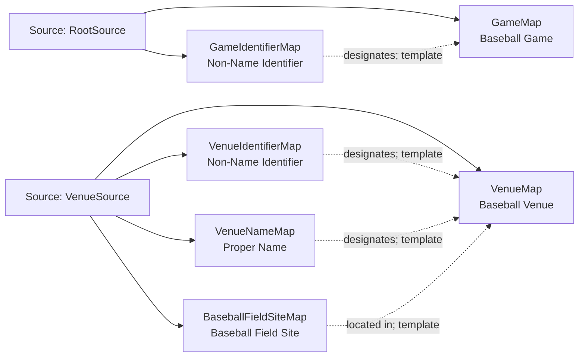

<!-- Generated by scripts/generate_rml_mermaid.py; do not edit. -->
<!-- Mapping SHA-256: 55c45ecc9df86d579681cfa026c088b432d3de03bbb7b6183ebb6c6fdd04c5dd -->

# Game and venue - MLB game RML

A baseball game occurs at a baseball-field site associated with a venue and is designated by a source identifier.

Solid relation arrows are explicit parent-triples-map joins. Dotted relation arrows are IRI-template matches inferred by the reviewer from the actual RML templates. Cross-pattern targets are listed in the table rather than drawn, keeping the diagram small.

## Logical sources

| Source | Execution file | JSONPath iterator | Maps in this review |
| --- | --- | --- | ---: |
| `RootSource` | `game.json` | `$` | 2 |
| `VenueSource` | `game.json` | `$.gameData.venue` | 4 |

## Triples maps

| Triples map | Subject class | Emitted relations | Cross-pattern targets |
| --- | --- | --- | --- |
| `GameMap` | Baseball Game | has participant, occupies temporal region, occurs at | has participant -> Team (template), occupies temporal region -> GameTemporalIntervalMap (template), occurs at -> Baseball Field (template) |
| `GameIdentifierMap` | Non-Name Identifier | designates, has text value | none |
| `VenueMap` | Baseball Venue | label | none |
| `VenueIdentifierMap` | Non-Name Identifier | designates, has text value | none |
| `VenueNameMap` | Proper Name | designates, has text value | none |
| `BaseballFieldSiteMap` | Baseball Field Site | located in | none |
