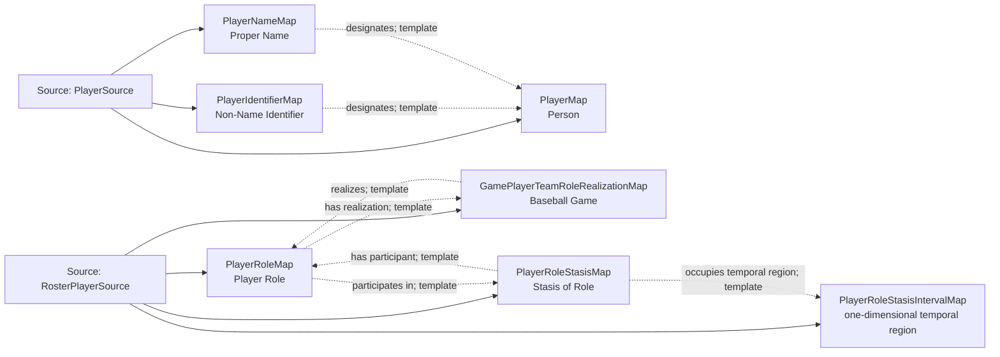

<!-- Generated by scripts/generate_rml_mermaid.py; do not edit. -->
<!-- Mapping SHA-256: bca42ec534c9be7569f69d0fa65d49406cb4139125c1720503fdd2756abefb40 -->

# Player identity - MLB game RML

Every accepted player participates in the game and bears a team-scoped PlayerRole that the game realizes, including players who remain on the bench; the role participates in an open role stasis.

Solid relation arrows are explicit parent-triples-map joins. Dotted relation arrows are IRI-template matches inferred by the reviewer from the actual RML templates. Cross-pattern targets are listed in the table rather than drawn, keeping the diagram small.

## Logical sources

| Source | Execution file | JSONPath iterator | Maps in this review |
| --- | --- | --- | ---: |
| `PlayerSource` | `game.json` | `$.gameData.players.*` | 3 |
| `RosterPlayerSource` | `game-context.json` | `$.liveData.boxscore.teams.*.players.*` | 4 |

## Triples maps

| Triples map | Subject class | Emitted relations | Cross-pattern targets |
| --- | --- | --- | --- |
| `PlayerMap` | Person | label | none |
| `PlayerIdentifierMap` | Non-Name Identifier | designates, has text value | none |
| `PlayerNameMap` | Proper Name | designates, has text value | none |
| `PlayerRoleMap` | Player Role | has organizational context, has realization, inheres in, participates in | has organizational context -> Team (template), inheres in -> Player (template) |
| `GamePlayerTeamRoleRealizationMap` | Baseball Game | has participant, realizes | has participant -> Player (template) |
| `PlayerRoleStasisMap` | Stasis of Role | has participant, occupies temporal region | has participant -> Player (template) |
| `PlayerRoleStasisIntervalMap` | one-dimensional temporal region | type assertion only | none |
