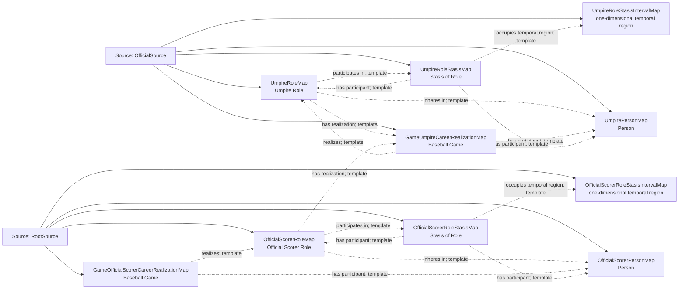

<!-- Generated by scripts/generate_rml_mermaid.py; do not edit. -->
<!-- Mapping SHA-256: ef70601419120731d914fe59980ec1dbefa4ce070f2bbca8ce5b46dbea3cb112 -->

# Game officials - MLB game RML

Umpires and the official scorer bear persistent adjudicator roles that the game realizes and that participate in open role stases.

Solid relation arrows are explicit parent-triples-map joins. Dotted relation arrows are IRI-template matches inferred by the reviewer from the actual RML templates. Cross-pattern targets are listed in the table rather than drawn, keeping the diagram small.

## Logical sources

| Source | Execution file | JSONPath iterator | Maps in this review |
| --- | --- | --- | ---: |
| `OfficialSource` | `game-context.json` | `$.liveData.boxscore.officials[*]` | 5 |
| `RootSource` | `game.json` | `$` | 5 |

## Triples maps

| Triples map | Subject class | Emitted relations | Cross-pattern targets |
| --- | --- | --- | --- |
| `UmpirePersonMap` | Person | type assertion only | none |
| `UmpireRoleMap` | Umpire Role | has realization, inheres in, participates in | none |
| `GameUmpireCareerRealizationMap` | Baseball Game | has participant, realizes | none |
| `UmpireRoleStasisMap` | Stasis of Role | has participant, occupies temporal region | none |
| `UmpireRoleStasisIntervalMap` | one-dimensional temporal region | type assertion only | none |
| `OfficialScorerPersonMap` | Person | label | none |
| `OfficialScorerRoleMap` | Official Scorer Role | has realization, inheres in, participates in | none |
| `GameOfficialScorerCareerRealizationMap` | Baseball Game | has participant, realizes | none |
| `OfficialScorerRoleStasisMap` | Stasis of Role | has participant, occupies temporal region | none |
| `OfficialScorerRoleStasisIntervalMap` | one-dimensional temporal region | type assertion only | none |
