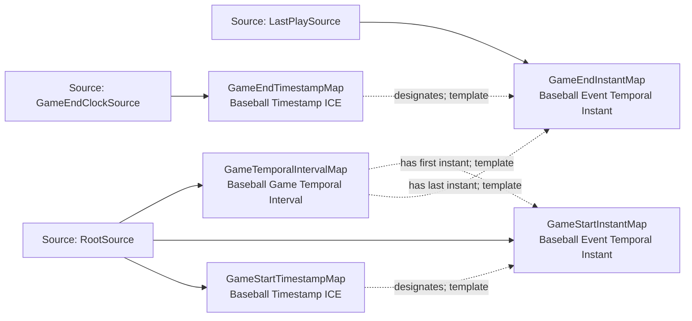

<!-- Generated by scripts/generate_rml_mermaid.py; do not edit. -->
<!-- Mapping SHA-256: b89377d634df094aef78de708e811ac44b66284dbbc0ba86bb21cde578077127 -->

# Game temporal region - MLB game RML

A game occupies an interval bounded by temporal instants that are designated by timestamp information.

Solid relation arrows are explicit parent-triples-map joins. Dotted arrows match IRI templates or IRI-valued references within the same logical source. Cross-pattern targets are listed in the table rather than drawn. Unresolved dynamic resource types remain generic; the accepted design supplies their reviewed interpretation.

## Logical sources

| Source | Execution file | JSONPath iterator | Maps in this review |
| --- | --- | --- | ---: |
| `GameEndClockSource` | `game-context.json` | `$._baseballO.gameEndClocks[*]` | 1 |
| `LastPlaySource` | `game-context.json` | `$` | 1 |
| `RootSource` | `game.json` | `$` | 3 |

## Triples maps

| Triples map | Subject class | Emitted relations | Cross-pattern targets |
| --- | --- | --- | --- |
| `GameTemporalIntervalMap` | Baseball Game Temporal Interval | has first instant, has last instant | none |
| `GameStartInstantMap` | Baseball Event Temporal Instant | type assertion only | none |
| `GameStartTimestampMap` | Baseball Timestamp ICE | designates, has datetime value, is about | is about -> GameMap (template) |
| `GameEndInstantMap` | Baseball Event Temporal Instant | type assertion only | none |
| `GameEndTimestampMap` | Baseball Timestamp ICE | designates, has datetime value, is about | is about -> GameMap (template) |
