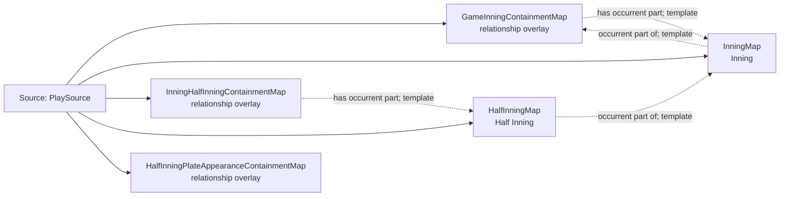

<!-- Generated by scripts/generate_rml_mermaid.py; do not edit. -->
<!-- Mapping SHA-256: f1f0054989fa91a76b8aa21a857f8b08cdeea24a88177e68a5ec0bb7ad0c493e -->

# Game containment - MLB game RML

Game, inning, half inning, and plate appearance form an explicit occurrent-part hierarchy.

Solid relation arrows are explicit parent-triples-map joins. Dotted arrows match IRI templates or IRI-valued references within the same logical source. Cross-pattern targets are listed in the table rather than drawn. Unresolved dynamic resource types remain generic; the accepted design supplies their reviewed interpretation.

## Logical sources

| Source | Execution file | JSONPath iterator | Maps in this review |
| --- | --- | --- | ---: |
| `PlaySource` | `game-context.json` | `$.liveData.plays.allPlays[?(@._baseballO.hasPlateAppearanceStructure == true)]` | 5 |

## Triples maps

| Triples map | Subject class | Emitted relations | Cross-pattern targets |
| --- | --- | --- | --- |
| `GameInningContainmentMap` | relationship overlay | has occurrent part | none |
| `InningMap` | Inning | occurrent part of, occurs at | occurs at -> Baseball Field (template) |
| `InningHalfInningContainmentMap` | relationship overlay | has occurrent part | none |
| `HalfInningMap` | Half Inning | occurrent part of, occurs at | occurs at -> Baseball Field (template) |
| `HalfInningPlateAppearanceContainmentMap` | relationship overlay | has occurrent part | has occurrent part -> PlateAppearanceMap (template) |
