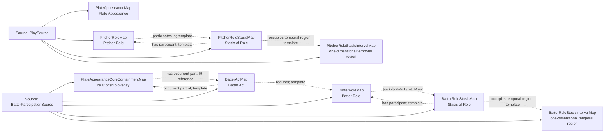

<!-- Generated by scripts/generate_rml_mermaid.py; do not edit. -->
<!-- Mapping SHA-256: 9dda8b5110491293e9b7c93625275eca382790b5a0be0147b2781cea4a2d4a47 -->

# Plate appearance and player acts - MLB game RML

A plate appearance contains distinct Batter Acts for each actual uninterrupted batting participant, reusing persistent Batter Roles; actual participation remains separate from official statistical PA credit.

Solid relation arrows are explicit parent-triples-map joins. Dotted arrows match IRI templates or IRI-valued references within the same logical source. Cross-pattern targets are listed in the table rather than drawn. Unresolved dynamic resource types remain generic; the accepted design supplies their reviewed interpretation.

## Logical sources

| Source | Execution file | JSONPath iterator | Maps in this review |
| --- | --- | --- | ---: |
| `BatterParticipationSource` | `game-context.json` | `$.liveData.plays.allPlays[*]._baseballO.batterParticipations[*]` | 5 |
| `PlaySource` | `game-context.json` | `$.liveData.plays.allPlays[?(@._baseballO.hasPlateAppearanceStructure == true)]` | 4 |

## Triples maps

| Triples map | Subject class | Emitted relations | Cross-pattern targets |
| --- | --- | --- | --- |
| `PlateAppearanceMap` | Plate Appearance | has participant, occupies temporal region, occurrent part of, occurs at | has participant -> Player (template), occupies temporal region -> PlateAppearanceIntervalMap (template), occurrent part of -> HalfInningMap (template), occurs at -> Baseball Field (template) |
| `PlateAppearanceCoreContainmentMap` | relationship overlay | has occurrent part, has participant | has participant -> Player (template) |
| `BatterActMap` | Batter Act | has participant, occurrent part of, occurs at, realizes | has participant -> Player (template), occurs at -> Baseball Field (template) |
| `BatterRoleMap` | Batter Role | inheres in, participates in | inheres in -> Player (template) |
| `BatterRoleStasisMap` | Stasis of Role | has participant, occupies temporal region | has participant -> Player (template) |
| `BatterRoleStasisIntervalMap` | one-dimensional temporal region | type assertion only | none |
| `PitcherRoleMap` | Pitcher Role | inheres in, participates in | inheres in -> Player (template) |
| `PitcherRoleStasisMap` | Stasis of Role | has participant, occupies temporal region | has participant -> Player (template) |
| `PitcherRoleStasisIntervalMap` | one-dimensional temporal region | type assertion only | none |
