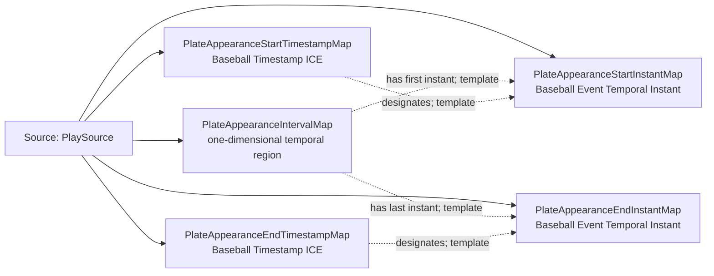

<!-- Generated by scripts/generate_rml_mermaid.py; do not edit. -->
<!-- Mapping SHA-256: 11be74814589051873cc48ee2c8577d3b1303ac7473b6114aa6740b30df96d0f -->

# Plate appearance time - MLB game RML

A plate appearance occupies an interval whose first and last instants are designated by timestamps.

Solid relation arrows are explicit parent-triples-map joins. Dotted arrows match IRI templates or IRI-valued references within the same logical source. Cross-pattern targets are listed in the table rather than drawn. Unresolved dynamic resource types remain generic; the accepted design supplies their reviewed interpretation.

## Logical sources

| Source | Execution file | JSONPath iterator | Maps in this review |
| --- | --- | --- | ---: |
| `PlaySource` | `game-context.json` | `$.liveData.plays.allPlays[?(@._baseballO.hasPlateAppearanceStructure == true)]` | 5 |

## Triples maps

| Triples map | Subject class | Emitted relations | Cross-pattern targets |
| --- | --- | --- | --- |
| `PlateAppearanceIntervalMap` | one-dimensional temporal region | has first instant, has last instant, temporal part of | temporal part of -> GameTemporalIntervalMap (template) |
| `PlateAppearanceStartInstantMap` | Baseball Event Temporal Instant | type assertion only | none |
| `PlateAppearanceStartTimestampMap` | Baseball Timestamp ICE | designates, has datetime value, is about | is about -> PlateAppearanceMap (template) |
| `PlateAppearanceEndInstantMap` | Baseball Event Temporal Instant | type assertion only | none |
| `PlateAppearanceEndTimestampMap` | Baseball Timestamp ICE | designates, has datetime value, is about | is about -> PlateAppearanceMap (template) |
