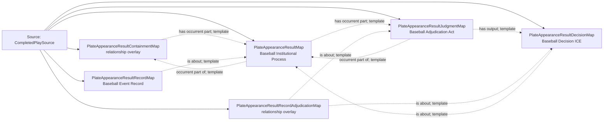

<!-- Generated by scripts/generate_rml_mermaid.py; do not edit. -->
<!-- Mapping SHA-256: 0525c6bf4b5afe22d7f8ed5ae6ba27fe96831e3a0765c0c3bf5a615539bc1189 -->

# Plate appearance result and adjudication - MLB game RML

Every plate-appearance result is a distinct institutional process with an adjudication act, decision, and event record.

Solid relation arrows are explicit parent-triples-map joins. Dotted arrows match IRI templates or IRI-valued references within the same logical source. Cross-pattern targets are listed in the table rather than drawn. Unresolved dynamic resource types remain generic; the accepted design supplies their reviewed interpretation.

## Logical sources

| Source | Execution file | JSONPath iterator | Maps in this review |
| --- | --- | --- | ---: |
| `CompletedPlaySource` | `game-context.json` | `$.liveData.plays.allPlays[?(@._baseballO.hasCompletedPlateAppearanceResult == true)]` | 6 |

## Triples maps

| Triples map | Subject class | Emitted relations | Cross-pattern targets |
| --- | --- | --- | --- |
| `PlateAppearanceResultContainmentMap` | relationship overlay | has occurrent part | none |
| `PlateAppearanceResultMap` | Baseball Institutional Process | has occurrent part, has participant, occurrent part of, occurs at | has participant -> Player (template), occurs at -> Baseball Field (template) |
| `PlateAppearanceResultJudgmentMap` | Baseball Adjudication Act | has output, occurrent part of, occurs at | occurs at -> Baseball Field (template) |
| `PlateAppearanceResultDecisionMap` | Baseball Decision ICE | is about | none |
| `PlateAppearanceResultRecordMap` | Baseball Event Record | has text value, is about | none |
| `PlateAppearanceResultRecordAdjudicationMap` | relationship overlay | is about | none |
