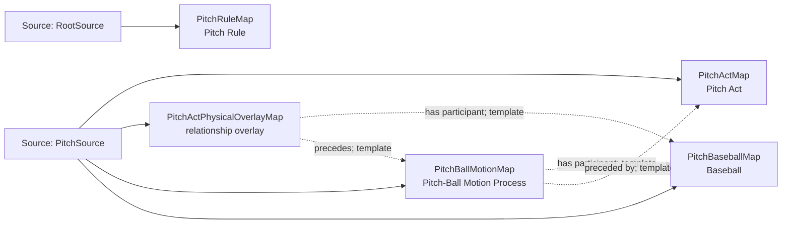

<!-- Generated by scripts/generate_rml_mermaid.py; do not edit. -->
<!-- Mapping SHA-256: 01f3efbccd0d2691d2b9ea22d2976ccca3e092a05a923e48639427281ac4ce8b -->

# Pitch physical chain - MLB game RML

A pitch act precedes a pitch-ball-motion process involving a pitch-scoped baseball and governed by the pitch rule.

Solid relation arrows are explicit parent-triples-map joins. Dotted relation arrows are IRI-template matches inferred by the reviewer from the actual RML templates. Cross-pattern targets are listed in the table rather than drawn, keeping the diagram small.

## Logical sources

| Source | Execution file | JSONPath iterator | Maps in this review |
| --- | --- | --- | ---: |
| `PitchSource` | `game-context.json` | `$.liveData.plays.allPlays[*].playEvents[?(@.isPitch == true)]` | 4 |
| `RootSource` | `game.json` | `$` | 1 |

## Triples maps

| Triples map | Subject class | Emitted relations | Cross-pattern targets |
| --- | --- | --- | --- |
| `PitchActMap` | Pitch Act | has participant, occupies temporal region, occurrent part of, occurs at, realizes | has participant -> Player (template), occupies temporal region -> PitchIntervalMap (template), occurrent part of -> Plate Appearance (template), occurs at -> Baseball Field (template), realizes -> Pitcher (template) |
| `PitchActPhysicalOverlayMap` | relationship overlay | has participant, precedes | none |
| `PitchBallMotionMap` | Pitch-Ball Motion Process | has participant, occurrent part of, occurs at, preceded by | occurrent part of -> Plate Appearance (template), occurs at -> Baseball Field (template) |
| `PitchBaseballMap` | Baseball | type assertion only | none |
| `PitchRuleMap` | Pitch Rule | type assertion only | none |
