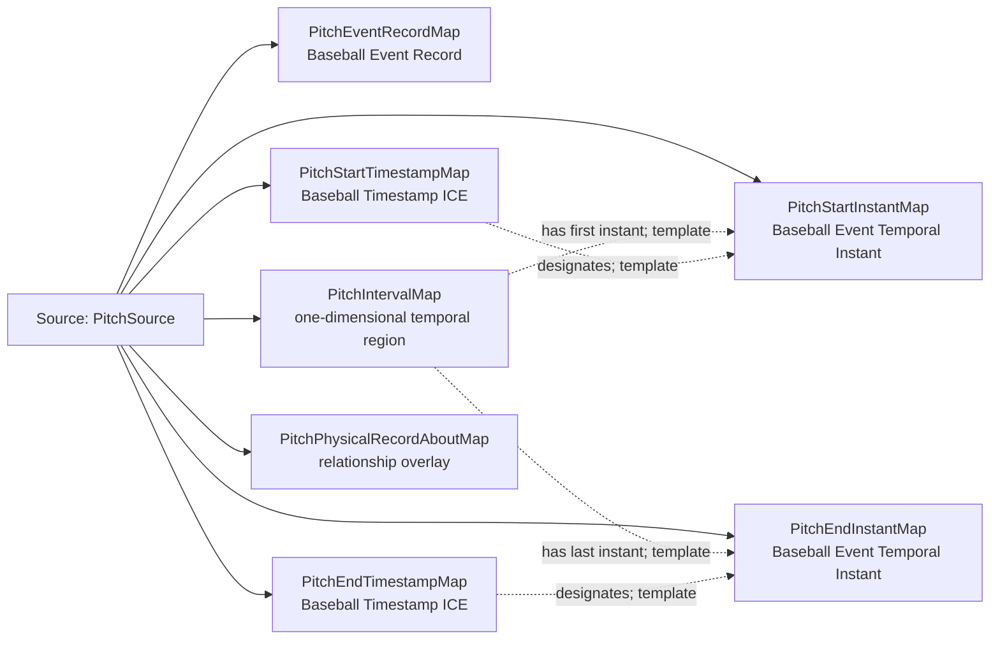

<!-- Generated by scripts/generate_rml_mermaid.py; do not edit. -->
<!-- Mapping SHA-256: bed3f052e82a896b8529c67b8e2a5c9746b06eef0788276d70bec48335fb63a4 -->

# Pitch time and record - MLB game RML

A pitch occupies a temporal interval, has timestamped endpoints, and is described by a separate event record.

Solid relation arrows are explicit parent-triples-map joins. Dotted arrows match IRI templates or IRI-valued references within the same logical source. Cross-pattern targets are listed in the table rather than drawn. Unresolved dynamic resource types remain generic; the accepted design supplies their reviewed interpretation.

## Logical sources

| Source | Execution file | JSONPath iterator | Maps in this review |
| --- | --- | --- | ---: |
| `PitchSource` | `game-context.json` | `$.liveData.plays.allPlays[*].playEvents[?(@.isPitch == true)]` | 7 |

## Triples maps

| Triples map | Subject class | Emitted relations | Cross-pattern targets |
| --- | --- | --- | --- |
| `PitchEventRecordMap` | Baseball Event Record | has text value, is about | is about -> PitchActMap (template) |
| `PitchIntervalMap` | one-dimensional temporal region | has first instant, has last instant, temporal part of | temporal part of -> Temporal Interval (template) |
| `PitchStartInstantMap` | Baseball Event Temporal Instant | type assertion only | none |
| `PitchStartTimestampMap` | Baseball Timestamp ICE | designates, has datetime value, is about | is about -> PitchActMap (template) |
| `PitchEndInstantMap` | Baseball Event Temporal Instant | type assertion only | none |
| `PitchEndTimestampMap` | Baseball Timestamp ICE | designates, has datetime value, is about | is about -> PitchActMap (template) |
| `PitchPhysicalRecordAboutMap` | relationship overlay | is about | is about -> PitchBallMotionMap (template), is about -> PitchBaseballMap (template) |
