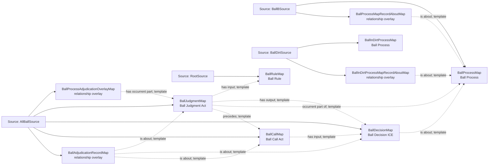

<!-- Generated by scripts/generate_rml_mermaid.py; do not edit. -->
<!-- Mapping SHA-256: bca42ec534c9be7569f69d0fa65d49406cb4139125c1720503fdd2756abefb40 -->

# Called ball adjudication - MLB game RML

A ball process follows pitch motion and contains a judgment that produces a decision used by a call act; ball-in-dirt is a source-supported variant.

Solid relation arrows are explicit parent-triples-map joins. Dotted relation arrows are IRI-template matches inferred by the reviewer from the actual RML templates. Cross-pattern targets are listed in the table rather than drawn, keeping the diagram small.

## Logical sources

| Source | Execution file | JSONPath iterator | Maps in this review |
| --- | --- | --- | ---: |
| `AllBallSource` | `game-context.json` | `$.liveData.plays.allPlays[*].playEvents[?(@.isPitch == true && @.details.call.code == 'B' \|\| @.isPitch == true && @.details.call.code == '*B')]` | 5 |
| `BallBSource` | `game-context.json` | `$.liveData.plays.allPlays[*].playEvents[?(@.isPitch == true && @.details.call.code == 'B')]` | 2 |
| `BallDirtSource` | `game-context.json` | `$.liveData.plays.allPlays[*].playEvents[?(@.isPitch == true && @.details.call.code == '*B')]` | 2 |
| `RootSource` | `game.json` | `$` | 1 |

## Triples maps

| Triples map | Subject class | Emitted relations | Cross-pattern targets |
| --- | --- | --- | --- |
| `BallProcessMap` | Ball Process | occurrent part of, occurs at, preceded by | occurrent part of -> Plate Appearance (template), occurs at -> Baseball Field (template), preceded by -> PitchBallMotionMap (template) |
| `BallProcessMapRecordAboutMap` | relationship overlay | is about | none |
| `BallInDirtProcessMap` | Ball Process | occurrent part of, occurs at, preceded by | occurrent part of -> Plate Appearance (template), occurs at -> Baseball Field (template), preceded by -> PitchBallMotionMap (template) |
| `BallInDirtProcessMapRecordAboutMap` | relationship overlay | is about | none |
| `BallProcessAdjudicationOverlayMap` | relationship overlay | has occurrent part | none |
| `BallJudgmentMap` | Ball Judgment Act | has input, has output, has participant, occurrent part of, precedes, realizes | has participant -> Person (template), realizes -> Umpire (template) |
| `BallDecisionMap` | Ball Decision ICE | is about | none |
| `BallCallMap` | Ball Call Act | has input, has participant, occurrent part of, realizes | has participant -> Person (template), occurrent part of -> Plate Appearance (template), realizes -> Umpire (template) |
| `BallAdjudicationRecordMap` | relationship overlay | is about | none |
| `BallRuleMap` | Ball Rule | type assertion only | none |
