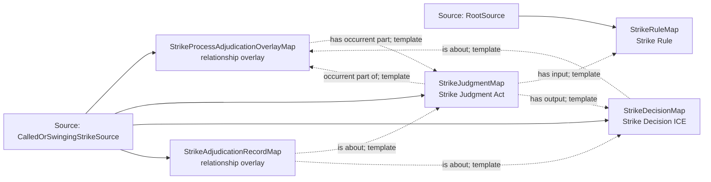

<!-- Generated by scripts/generate_rml_mermaid.py; do not edit. -->
<!-- Mapping SHA-256: bca42ec534c9be7569f69d0fa65d49406cb4139125c1720503fdd2756abefb40 -->

# Strike adjudication - MLB game RML

Called and swinging strikes share a counted strike judgment and decision pattern while retaining distinct source-specific branches.

Solid relation arrows are explicit parent-triples-map joins. Dotted relation arrows are IRI-template matches inferred by the reviewer from the actual RML templates. Cross-pattern targets are listed in the table rather than drawn, keeping the diagram small.

## Logical sources

| Source | Execution file | JSONPath iterator | Maps in this review |
| --- | --- | --- | ---: |
| `CalledOrSwingingStrikeSource` | `game-context.json` | `$.liveData.plays.allPlays[*].playEvents[?(@.isPitch == true && @.details.call.code == 'C' \|\| @.isPitch == true && @.details.call.code == 'S' \|\| @.isPitch == true && @.details.call.code == 'W' \|\| @.isPitch == true && @.details.call.code == 'M')]` | 4 |
| `RootSource` | `game.json` | `$` | 1 |

## Triples maps

| Triples map | Subject class | Emitted relations | Cross-pattern targets |
| --- | --- | --- | --- |
| `StrikeProcessAdjudicationOverlayMap` | relationship overlay | has occurrent part | none |
| `StrikeJudgmentMap` | Strike Judgment Act | has input, has output, has participant, occurrent part of, realizes | has participant -> Person (template), realizes -> Umpire (template) |
| `StrikeDecisionMap` | Strike Decision ICE | is about | none |
| `StrikeAdjudicationRecordMap` | relationship overlay | is about | none |
| `StrikeRuleMap` | Strike Rule | type assertion only | none |
