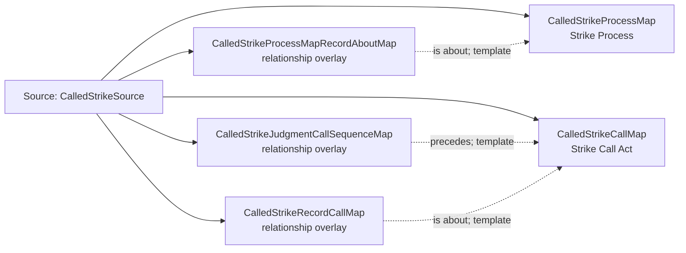

<!-- Generated by scripts/generate_rml_mermaid.py; do not edit. -->
<!-- Mapping SHA-256: 0525c6bf4b5afe22d7f8ed5ae6ba27fe96831e3a0765c0c3bf5a615539bc1189 -->

# Called strike - MLB game RML

A called strike process is followed by an explicit strike call act that consumes the strike decision.

Solid relation arrows are explicit parent-triples-map joins. Dotted arrows match IRI templates or IRI-valued references within the same logical source. Cross-pattern targets are listed in the table rather than drawn. Unresolved dynamic resource types remain generic; the accepted design supplies their reviewed interpretation.

## Logical sources

| Source | Execution file | JSONPath iterator | Maps in this review |
| --- | --- | --- | ---: |
| `CalledStrikeSource` | `game-context.json` | `$.liveData.plays.allPlays[*].playEvents[?(@.isPitch == true && @.details.call.code == 'C')]` | 5 |

## Triples maps

| Triples map | Subject class | Emitted relations | Cross-pattern targets |
| --- | --- | --- | --- |
| `CalledStrikeProcessMap` | Strike Process | occurrent part of, occurs at, preceded by | occurrent part of -> Plate Appearance (template), occurs at -> Baseball Field (template), preceded by -> PitchBallMotionMap (template) |
| `CalledStrikeProcessMapRecordAboutMap` | relationship overlay | is about | none |
| `CalledStrikeCallMap` | Strike Call Act | has input, has participant, occurrent part of, realizes | has input -> Referenced resource (IRI reference), has participant -> Person (template), occurrent part of -> Plate Appearance (template), realizes -> Umpire (template) |
| `CalledStrikeJudgmentCallSequenceMap` | relationship overlay | precedes | none |
| `CalledStrikeRecordCallMap` | relationship overlay | is about | none |
