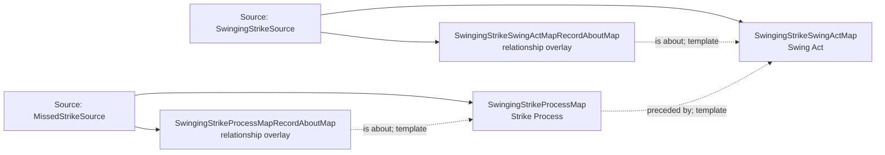

<!-- Generated by scripts/generate_rml_mermaid.py; do not edit. -->
<!-- Mapping SHA-256: 55c45ecc9df86d579681cfa026c088b432d3de03bbb7b6183ebb6c6fdd04c5dd -->

# Swinging strike without contact - MLB game RML

A neutral swing act precedes the counted strike process; no distinct successful or unsuccessful swing class is minted.

Solid relation arrows are explicit parent-triples-map joins. Dotted relation arrows are IRI-template matches inferred by the reviewer from the actual RML templates. Cross-pattern targets are listed in the table rather than drawn, keeping the diagram small.

## Logical sources

| Source | Execution file | JSONPath iterator | Maps in this review |
| --- | --- | --- | ---: |
| `MissedStrikeSource` | `game-context.json` | `$.liveData.plays.allPlays[*].playEvents[?(@.isPitch == true && @.details.call.code == 'S' \|\| @.isPitch == true && @.details.call.code == 'W' \|\| @.isPitch == true && @.details.call.code == 'M')]` | 2 |
| `SwingingStrikeSource` | `game-context.json` | `$.liveData.plays.allPlays[*].playEvents[?(@.isPitch == true && @._baseballO.isBuntAttempt == false && @.details.call.code == 'S' \|\| @.isPitch == true && @._baseballO.isBuntAttempt == false && @.details.call.code == 'W')]` | 2 |

## Triples maps

| Triples map | Subject class | Emitted relations | Cross-pattern targets |
| --- | --- | --- | --- |
| `SwingingStrikeSwingActMap` | Swing Act | has participant, occurrent part of, occurs at, preceded by, realizes | has participant -> Player (template), has participant -> SwingBaseballBatMap (template), occurrent part of -> Batter Act (template), occurrent part of -> Plate Appearance (template), occurs at -> Baseball Field (template), preceded by -> PitchActMap (template), realizes -> Batter (template) |
| `SwingingStrikeSwingActMapRecordAboutMap` | relationship overlay | is about | none |
| `SwingingStrikeProcessMap` | Strike Process | occurrent part of, occurs at, preceded by | occurrent part of -> Plate Appearance (template), occurs at -> Baseball Field (template) |
| `SwingingStrikeProcessMapRecordAboutMap` | relationship overlay | is about | none |
