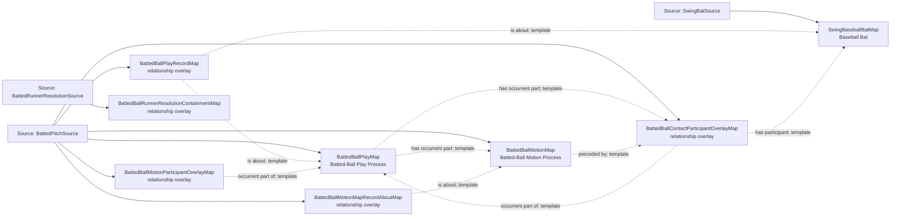

<!-- Generated by scripts/generate_rml_mermaid.py; do not edit. -->
<!-- Mapping SHA-256: 55c45ecc9df86d579681cfa026c088b432d3de03bbb7b6183ebb6c6fdd04c5dd -->

# Batted-ball physical backbone - MLB game RML

Contact and batted-ball motion are distinct physical processes contained in a batted-ball play. Supported runner resolutions may be parts of that same play; this structural link does not assert batter causation or metric credit.

Solid relation arrows are explicit parent-triples-map joins. Dotted relation arrows are IRI-template matches inferred by the reviewer from the actual RML templates. Cross-pattern targets are listed in the table rather than drawn, keeping the diagram small.

## Logical sources

| Source | Execution file | JSONPath iterator | Maps in this review |
| --- | --- | --- | ---: |
| `BattedPitchSource` | `game-context.json` | `$.liveData.plays.allPlays[*].playEvents[?(@.isPitch == true && @.details.call.code == 'F' \|\| @.isPitch == true && @.details.call.code == 'T' \|\| @.isPitch == true && @.details.call.code == 'L' \|\| @.isPitch == true && @.details.call.code == 'O' \|\| @.isPitch == true && @.details.call.code == 'X' \|\| @.isPitch == true && @.details.call.code == 'D' \|\| @.isPitch == true && @.details.call.code == 'E')]` | 6 |
| `BattedRunnerResolutionSource` | `game-context.json` | `$.liveData.plays.allPlays[*]._baseballO.battedRunnerResolutions[*]` | 1 |
| `SwingBatSource` | `game-context.json` | `$.liveData.plays.allPlays[*].playEvents[?(@.isPitch == true && @._baseballO.isBuntAttempt == false && @.details.call.code == 'S' \|\| @.isPitch == true && @._baseballO.isBuntAttempt == false && @.details.call.code == 'W' \|\| @.isPitch == true && @._baseballO.isBuntAttempt == false && @.details.call.code == 'F' \|\| @.isPitch == true && @._baseballO.isBuntAttempt == false && @.details.call.code == 'T' \|\| @.isPitch == true && @._baseballO.isBuntAttempt == false && @.details.call.code == 'X' \|\| @.isPitch == true && @._baseballO.isBuntAttempt == false && @.details.call.code == 'D' \|\| @.isPitch == true && @._baseballO.isBuntAttempt == false && @.details.call.code == 'E')]` | 1 |

## Triples maps

| Triples map | Subject class | Emitted relations | Cross-pattern targets |
| --- | --- | --- | --- |
| `BattedBallPlayMap` | Batted-Ball Play Process | has occurrent part, occurrent part of, occurs at | occurrent part of -> Plate Appearance (template), occurs at -> Baseball Field (template) |
| `BattedBallPlayRecordMap` | relationship overlay | is about | none |
| `BattedBallMotionMap` | Batted-Ball Motion Process | occurrent part of, occurs at, preceded by | occurrent part of -> Plate Appearance (template), occurs at -> Baseball Field (template) |
| `BattedBallMotionMapRecordAboutMap` | relationship overlay | is about | none |
| `BattedBallContactParticipantOverlayMap` | relationship overlay | has participant, occurrent part of | has participant -> PitchBaseballMap (template) |
| `BattedBallMotionParticipantOverlayMap` | relationship overlay | has participant, occurrent part of | has participant -> PitchBaseballMap (template) |
| `SwingBaseballBatMap` | Baseball Bat | type assertion only | none |
| `BattedBallRunnerResolutionContainmentMap` | relationship overlay | has occurrent part | has occurrent part -> Runner Resolution (template) |
