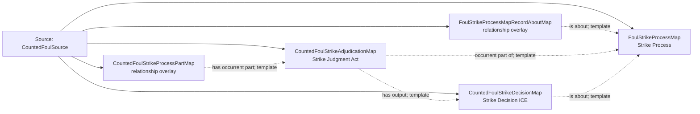

<!-- Generated by scripts/generate_rml_mermaid.py; do not edit. -->
<!-- Mapping SHA-256: bca42ec534c9be7569f69d0fa65d49406cb4139125c1720503fdd2756abefb40 -->

# Counted foul strike - MLB game RML

Where the event-local count is unambiguous, a foul contains a separately adjudicated counted strike process.

Solid relation arrows are explicit parent-triples-map joins. Dotted relation arrows are IRI-template matches inferred by the reviewer from the actual RML templates. Cross-pattern targets are listed in the table rather than drawn, keeping the diagram small.

## Logical sources

| Source | Execution file | JSONPath iterator | Maps in this review |
| --- | --- | --- | ---: |
| `CountedFoulSource` | `game-context.json` | `$.liveData.plays.allPlays[*].playEvents[?(@.isPitch == true && @.details.call.code == 'F' && @.count.strikes == 1)]` | 5 |

## Triples maps

| Triples map | Subject class | Emitted relations | Cross-pattern targets |
| --- | --- | --- | --- |
| `FoulStrikeProcessMap` | Strike Process | occurrent part of, occurs at, preceded by | occurrent part of -> Plate Appearance (template), occurs at -> Baseball Field (template), preceded by -> FoulBallProcessMap (template) |
| `FoulStrikeProcessMapRecordAboutMap` | relationship overlay | is about | none |
| `CountedFoulStrikeProcessPartMap` | relationship overlay | has occurrent part | none |
| `CountedFoulStrikeAdjudicationMap` | Strike Judgment Act | has input, has output, occurrent part of | has input -> StrikeRuleMap (template) |
| `CountedFoulStrikeDecisionMap` | Strike Decision ICE | is about | none |
