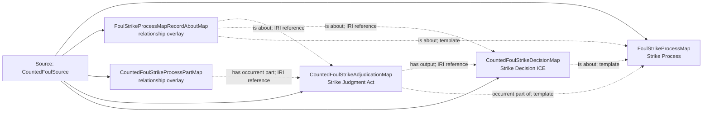

<!-- Generated by scripts/generate_rml_mermaid.py; do not edit. -->
<!-- Mapping SHA-256: 11be74814589051873cc48ee2c8577d3b1303ac7473b6114aa6740b30df96d0f -->

# Counted foul strike - MLB game RML

Where the event-local count is unambiguous, a foul contains a separately adjudicated counted strike process.

Solid relation arrows are explicit parent-triples-map joins. Dotted arrows match IRI templates or IRI-valued references within the same logical source. Cross-pattern targets are listed in the table rather than drawn. Unresolved dynamic resource types remain generic; the accepted design supplies their reviewed interpretation.

## Logical sources

| Source | Execution file | JSONPath iterator | Maps in this review |
| --- | --- | --- | ---: |
| `CountedFoulSource` | `game-context.json` | `$.liveData.plays.allPlays[*].playEvents[?(@.isPitch == true && @.details.call.code == 'F' && @.count.strikes == 1 \|\| @.isPitch == true && @._baseballO.isSecondCountedFoul == true \|\| @.isPitch == true && @._baseballO.isCountedFoulBunt == true)]` | 5 |

## Triples maps

| Triples map | Subject class | Emitted relations | Cross-pattern targets |
| --- | --- | --- | --- |
| `FoulStrikeProcessMap` | Strike Process | occurrent part of, occurs at, preceded by | occurrent part of -> Plate Appearance (template), occurs at -> Baseball Field (template), preceded by -> FoulBallProcessMap (template) |
| `FoulStrikeProcessMapRecordAboutMap` | relationship overlay | is about | none |
| `CountedFoulStrikeProcessPartMap` | relationship overlay | has occurrent part | none |
| `CountedFoulStrikeAdjudicationMap` | Strike Judgment Act | has input, has output, occurrent part of | has input -> StrikeRuleMap (template) |
| `CountedFoulStrikeDecisionMap` | Strike Decision ICE | is about | none |
