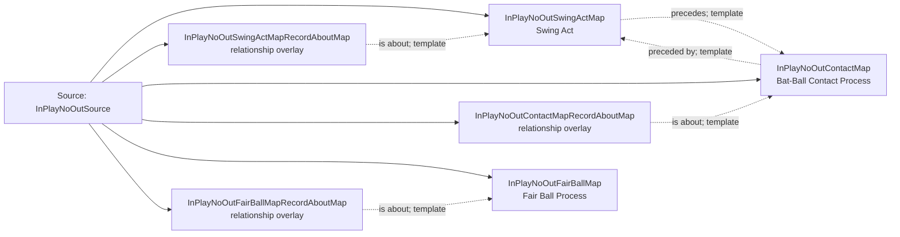

<!-- Generated by scripts/generate_rml_mermaid.py; do not edit. -->
<!-- Mapping SHA-256: eb537822e4bab673851aa84bf233b33843d82c93e6cce031fecfd402d6c46950 -->

# In-play no-out contact - MLB game RML

A swing and contact precede a fair-ball process for an in-play event whose feed call records no out.

Solid relation arrows are explicit parent-triples-map joins. Dotted arrows match IRI templates or IRI-valued references within the same logical source. Cross-pattern targets are listed in the table rather than drawn. Unresolved dynamic resource types remain generic; the accepted design supplies their reviewed interpretation.

## Logical sources

| Source | Execution file | JSONPath iterator | Maps in this review |
| --- | --- | --- | ---: |
| `InPlayNoOutSource` | `game-context.json` | `$.liveData.plays.allPlays[*].playEvents[?(@.isPitch == true && @._baseballO.isBuntAttempt == false && @.details.call.code == 'D')]` | 6 |

## Triples maps

| Triples map | Subject class | Emitted relations | Cross-pattern targets |
| --- | --- | --- | --- |
| `InPlayNoOutSwingActMap` | Swing Act | has participant, occurrent part of, occurs at, preceded by, precedes, realizes | has participant -> Player (template), has participant -> SwingBaseballBatMap (template), occurrent part of -> Batter Act (template), occurrent part of -> Plate Appearance (template), occurs at -> Baseball Field (template), preceded by -> PitchActMap (template), realizes -> Batter (template) |
| `InPlayNoOutSwingActMapRecordAboutMap` | relationship overlay | is about | none |
| `InPlayNoOutContactMap` | Bat-Ball Contact Process | occurrent part of, occurs at, preceded by, precedes | occurrent part of -> Plate Appearance (template), occurs at -> Baseball Field (template), precedes -> BattedBallMotionMap (template) |
| `InPlayNoOutContactMapRecordAboutMap` | relationship overlay | is about | none |
| `InPlayNoOutFairBallMap` | Fair Ball Process | occurrent part of, occurs at, preceded by | occurrent part of -> Plate Appearance (template), occurs at -> Baseball Field (template), preceded by -> BattedBallMotionMap (template) |
| `InPlayNoOutFairBallMapRecordAboutMap` | relationship overlay | is about | none |
