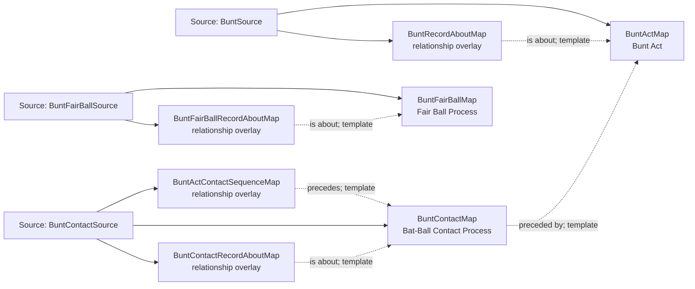

<!-- Generated by scripts/generate_rml_mermaid.py; do not edit. -->
<!-- Mapping SHA-256: 01f3efbccd0d2691d2b9ea22d2976ccca3e092a05a923e48639427281ac4ce8b -->

# Bunt contact - MLB game RML

Every supported bunt attempt creates a Bunt Act; only contact-supported attempts precede contact, and only in-play bunt evidence creates a fair-ball process.

Solid relation arrows are explicit parent-triples-map joins. Dotted relation arrows are IRI-template matches inferred by the reviewer from the actual RML templates. Cross-pattern targets are listed in the table rather than drawn, keeping the diagram small.

## Logical sources

| Source | Execution file | JSONPath iterator | Maps in this review |
| --- | --- | --- | ---: |
| `BuntContactSource` | `game-context.json` | `$.liveData.plays.allPlays[*].playEvents[?(@.isPitch == true && @._baseballO.matchesBuntContactSource == true)]` | 3 |
| `BuntFairBallSource` | `game-context.json` | `$.liveData.plays.allPlays[*].playEvents[?(@.isPitch == true && @._baseballO.isBuntAttempt == true && @.details.call.code == 'X' \|\| @.isPitch == true && @._baseballO.isBuntAttempt == true && @.details.call.code == 'D' \|\| @.isPitch == true && @._baseballO.isBuntAttempt == true && @.details.call.code == 'E')]` | 2 |
| `BuntSource` | `game-context.json` | `$.liveData.plays.allPlays[*].playEvents[?(@.isPitch == true && @._baseballO.isBuntAttempt == true)]` | 2 |

## Triples maps

| Triples map | Subject class | Emitted relations | Cross-pattern targets |
| --- | --- | --- | --- |
| `BuntActMap` | Bunt Act | has participant, occurrent part of, occurs at, preceded by, realizes | has participant -> Player (template), has participant -> SwingBaseballBatMap (template), occurrent part of -> Batter Act (template), occurrent part of -> Plate Appearance (template), occurs at -> Baseball Field (template), preceded by -> PitchActMap (template), realizes -> Batter (template) |
| `BuntActContactSequenceMap` | relationship overlay | precedes | none |
| `BuntContactMap` | Bat-Ball Contact Process | occurrent part of, occurs at, preceded by, precedes | occurrent part of -> Plate Appearance (template), occurs at -> Baseball Field (template), precedes -> BattedBallMotionMap (template) |
| `BuntFairBallMap` | Fair Ball Process | occurrent part of, occurs at, preceded by | occurrent part of -> Plate Appearance (template), occurs at -> Baseball Field (template), preceded by -> BattedBallMotionMap (template) |
| `BuntRecordAboutMap` | relationship overlay | is about | none |
| `BuntContactRecordAboutMap` | relationship overlay | is about | is about -> BattedBallMotionMap (template) |
| `BuntFairBallRecordAboutMap` | relationship overlay | is about | none |
