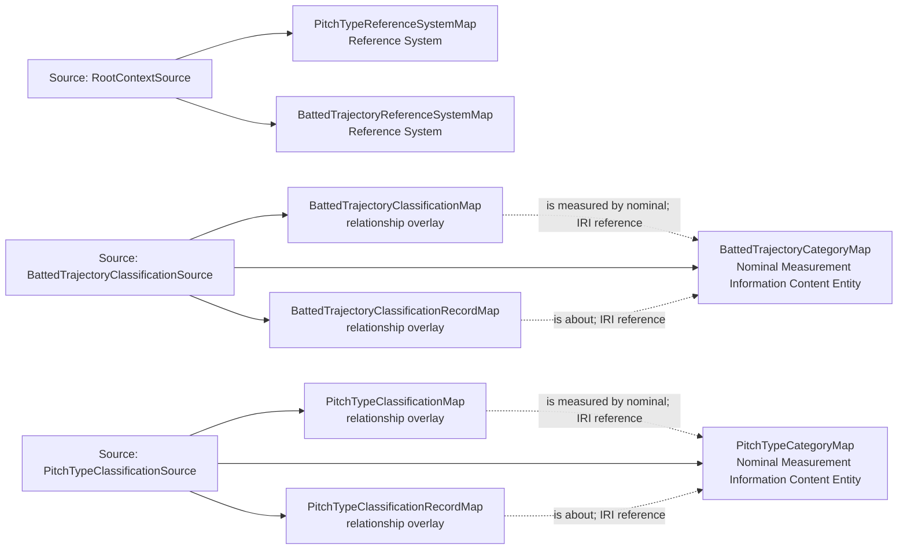

<!-- Generated by scripts/generate_rml_mermaid.py; do not edit. -->
<!-- Mapping SHA-256: 475f4c47f3b0bb3941dc4380421823ad817aec29e827ff53c3a606a354c62018 -->

# Nominal pitch and batted-ball trajectory classification - MLB game RML

A pitch or batted-ball motion is measured by a reusable nominal category ICE in a response-versioned Reference System; no provider coordinate is projected into a world-side Site.

Solid relation arrows are explicit parent-triples-map joins. Dotted arrows match IRI templates or IRI-valued references within the same logical source. Cross-pattern targets are listed in the table rather than drawn. Unresolved dynamic resource types remain generic; the accepted design supplies their reviewed interpretation.

## Logical sources

| Source | Execution file | JSONPath iterator | Maps in this review |
| --- | --- | --- | ---: |
| `BattedTrajectoryClassificationSource` | `game-context.json` | `$.liveData.plays.allPlays[*].playEvents[?(@.isPitch == true && @._baseballO.hasBattedTrajectoryCategory == true)]` | 3 |
| `PitchTypeClassificationSource` | `game-context.json` | `$.liveData.plays.allPlays[*].playEvents[?(@.isPitch == true && @._baseballO.hasPitchTypeCategory == true)]` | 3 |
| `RootContextSource` | `game-context.json` | `$._baseballO` | 2 |

## Triples maps

| Triples map | Subject class | Emitted relations | Cross-pattern targets |
| --- | --- | --- | --- |
| `PitchTypeReferenceSystemMap` | Reference System | label | none |
| `PitchTypeClassificationMap` | relationship overlay | is measured by nominal | none |
| `PitchTypeCategoryMap` | Nominal Measurement Information Content Entity | uses reference system | uses reference system -> Referenced resource (IRI reference) |
| `PitchTypeClassificationRecordMap` | relationship overlay | is about | none |
| `BattedTrajectoryReferenceSystemMap` | Reference System | label | none |
| `BattedTrajectoryClassificationMap` | relationship overlay | is measured by nominal | none |
| `BattedTrajectoryCategoryMap` | Nominal Measurement Information Content Entity | uses reference system | uses reference system -> Referenced resource (IRI reference) |
| `BattedTrajectoryClassificationRecordMap` | relationship overlay | is about | none |
