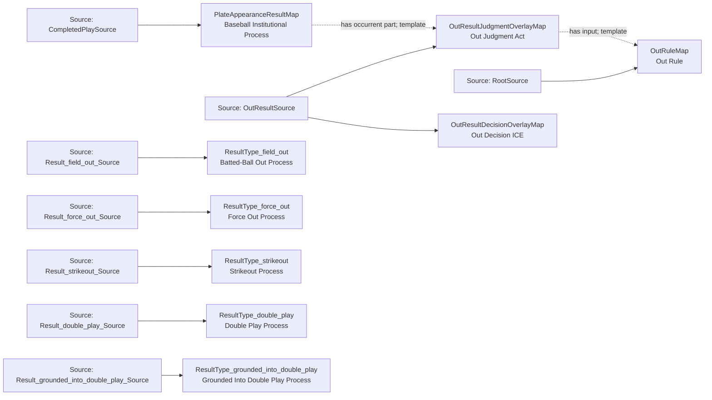

<!-- Generated by scripts/generate_rml_mermaid.py; do not edit. -->
<!-- Mapping SHA-256: 76b433db32acb7e8d69d7aeaabd0b6faa4e1973919c14b99d49047880065e471 -->

# Counted out results - MLB game RML

Batted outs, force outs, strikeouts, double plays, and grounded-into-double-play results share an out adjudication overlay.

Solid relation arrows are explicit parent-triples-map joins. Dotted relation arrows are IRI-template matches inferred by the reviewer from the actual RML templates. Cross-pattern targets are listed in the table rather than drawn, keeping the diagram small.

## Logical sources

| Source | Execution file | JSONPath iterator | Maps in this review |
| --- | --- | --- | ---: |
| `CompletedPlaySource` | `game-context.json` | `$.liveData.plays.allPlays[?(@._baseballO.hasCompletedPlateAppearanceResult == true)]` | 1 |
| `OutResultSource` | `game-context.json` | `$.liveData.plays.allPlays[?(@._baseballO.hasCompletedPlateAppearanceResult == true && @.result.eventType == 'field_out' \|\| @._baseballO.hasCompletedPlateAppearanceResult == true && @.result.eventType == 'force_out' \|\| @._baseballO.hasCompletedPlateAppearanceResult == true && @.result.eventType == 'strikeout' \|\| @._baseballO.hasCompletedPlateAppearanceResult == true && @.result.eventType == 'double_play' \|\| @._baseballO.hasCompletedPlateAppearanceResult == true && @.result.eventType == 'grounded_into_double_play' \|\| @._baseballO.hasCompletedPlateAppearanceResult == true && @.result.eventType == 'triple_play')]` | 2 |
| `Result_double_play_Source` | `game-context.json` | `$.liveData.plays.allPlays[?(@._baseballO.hasCompletedPlateAppearanceResult == true && @.result.eventType == 'double_play')]` | 1 |
| `Result_field_out_Source` | `game-context.json` | `$.liveData.plays.allPlays[?(@._baseballO.hasCompletedPlateAppearanceResult == true && @.result.eventType == 'field_out' \|\| @._baseballO.hasCompletedPlateAppearanceResult == true && @.result.eventType == 'triple_play')]` | 1 |
| `Result_force_out_Source` | `game-context.json` | `$.liveData.plays.allPlays[?(@._baseballO.hasCompletedPlateAppearanceResult == true && @.result.eventType == 'force_out')]` | 1 |
| `Result_grounded_into_double_play_Source` | `game-context.json` | `$.liveData.plays.allPlays[?(@._baseballO.hasCompletedPlateAppearanceResult == true && @.result.eventType == 'grounded_into_double_play')]` | 1 |
| `Result_strikeout_Source` | `game-context.json` | `$.liveData.plays.allPlays[?(@._baseballO.hasCompletedPlateAppearanceResult == true && @.result.eventType == 'strikeout')]` | 1 |
| `RootSource` | `game.json` | `$` | 1 |

## Triples maps

| Triples map | Subject class | Emitted relations | Cross-pattern targets |
| --- | --- | --- | --- |
| `PlateAppearanceResultMap` | Baseball Institutional Process | has occurrent part, has participant, occurrent part of, occurs at | has participant -> Player (template), occurrent part of -> PlateAppearanceMap (template), occurs at -> Baseball Field (template) |
| `ResultType_field_out` | Batted-Ball Out Process | type assertion only | none |
| `ResultType_force_out` | Force Out Process | type assertion only | none |
| `ResultType_strikeout` | Strikeout Process | type assertion only | none |
| `ResultType_double_play` | Double Play Process | type assertion only | none |
| `ResultType_grounded_into_double_play` | Grounded Into Double Play Process | type assertion only | none |
| `OutResultJudgmentOverlayMap` | Out Judgment Act | has input | none |
| `OutResultDecisionOverlayMap` | Out Decision ICE | type assertion only | none |
| `OutRuleMap` | Out Rule | type assertion only | none |
