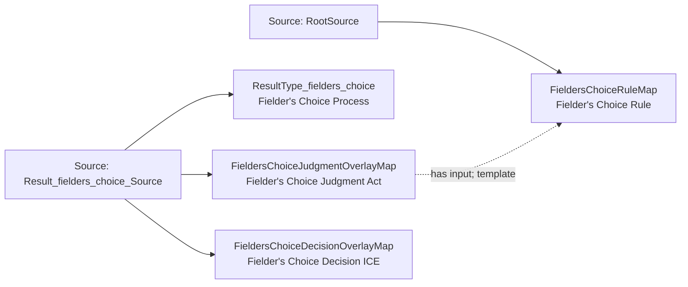

<!-- Generated by scripts/generate_rml_mermaid.py; do not edit. -->
<!-- Mapping SHA-256: 0525c6bf4b5afe22d7f8ed5ae6ba27fe96831e3a0765c0c3bf5a615539bc1189 -->

# Fielder's-choice result - MLB game RML

A fielder's-choice result carries its own judgment and decision using the fielder's-choice rule.

Solid relation arrows are explicit parent-triples-map joins. Dotted arrows match IRI templates or IRI-valued references within the same logical source. Cross-pattern targets are listed in the table rather than drawn. Unresolved dynamic resource types remain generic; the accepted design supplies their reviewed interpretation.

## Logical sources

| Source | Execution file | JSONPath iterator | Maps in this review |
| --- | --- | --- | ---: |
| `Result_fielders_choice_Source` | `game-context.json` | `$.liveData.plays.allPlays[?(@._baseballO.hasCompletedPlateAppearanceResult == true && @.result.eventType == 'fielders_choice' \|\| @._baseballO.hasCompletedPlateAppearanceResult == true && @.result.eventType == 'fielders_choice_out')]` | 3 |
| `RootSource` | `game.json` | `$` | 1 |

## Triples maps

| Triples map | Subject class | Emitted relations | Cross-pattern targets |
| --- | --- | --- | --- |
| `ResultType_fielders_choice` | Fielder's Choice Process | type assertion only | none |
| `FieldersChoiceJudgmentOverlayMap` | Fielder's Choice Judgment Act | has input, has participant, realizes | has participant -> Person (template), realizes -> Official Scorer (template) |
| `FieldersChoiceDecisionOverlayMap` | Fielder's Choice Decision ICE | type assertion only | none |
| `FieldersChoiceRuleMap` | Fielder's Choice Rule | type assertion only | none |
