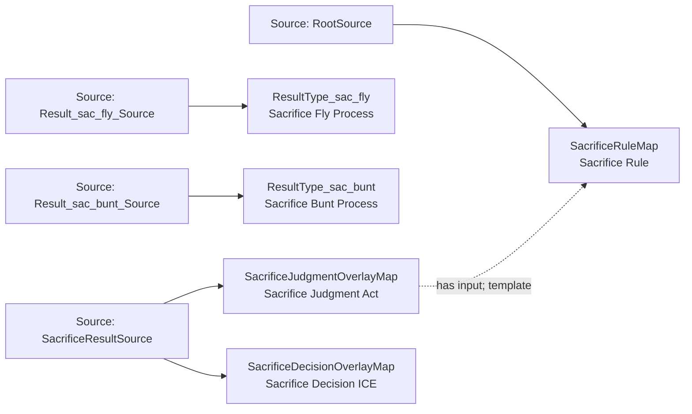

<!-- Generated by scripts/generate_rml_mermaid.py; do not edit. -->
<!-- Mapping SHA-256: 8c345042ecb2958d80d8fed5ce06613c31a202b499d928f3fbad5f6be2d4170c -->

# Sacrifice results - MLB game RML

Sacrifice-fly and sacrifice-bunt result types share a sacrifice judgment and decision overlay.

Solid relation arrows are explicit parent-triples-map joins. Dotted arrows match IRI templates or IRI-valued references within the same logical source. Cross-pattern targets are listed in the table rather than drawn. Unresolved dynamic resource types remain generic; the accepted design supplies their reviewed interpretation.

## Logical sources

| Source | Execution file | JSONPath iterator | Maps in this review |
| --- | --- | --- | ---: |
| `Result_sac_bunt_Source` | `game-context.json` | `$.liveData.plays.allPlays[?(@._baseballO.hasCompletedPlateAppearanceResult == true && @.result.eventType == 'sac_bunt')]` | 1 |
| `Result_sac_fly_Source` | `game-context.json` | `$.liveData.plays.allPlays[?(@._baseballO.hasCompletedPlateAppearanceResult == true && @.result.eventType == 'sac_fly')]` | 1 |
| `RootSource` | `game.json` | `$` | 1 |
| `SacrificeResultSource` | `game-context.json` | `$.liveData.plays.allPlays[?(@._baseballO.hasCompletedPlateAppearanceResult == true && @.result.eventType == 'sac_fly' \|\| @._baseballO.hasCompletedPlateAppearanceResult == true && @.result.eventType == 'sac_bunt')]` | 2 |

## Triples maps

| Triples map | Subject class | Emitted relations | Cross-pattern targets |
| --- | --- | --- | --- |
| `ResultType_sac_fly` | Sacrifice Fly Process | type assertion only | none |
| `ResultType_sac_bunt` | Sacrifice Bunt Process | type assertion only | none |
| `SacrificeJudgmentOverlayMap` | Sacrifice Judgment Act | has input, has participant, realizes | has participant -> Person (template), realizes -> Official Scorer (template) |
| `SacrificeDecisionOverlayMap` | Sacrifice Decision ICE | type assertion only | none |
| `SacrificeRuleMap` | Sacrifice Rule | type assertion only | none |
