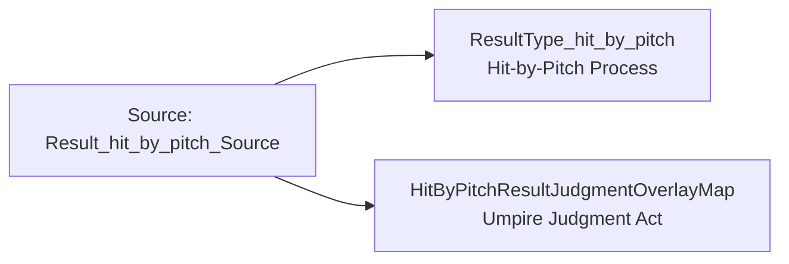

<!-- Generated by scripts/generate_rml_mermaid.py; do not edit. -->
<!-- Mapping SHA-256: 11be74814589051873cc48ee2c8577d3b1303ac7473b6114aa6740b30df96d0f -->

# Hit-by-pitch result - MLB game RML

Hit by pitch is a specific plate-appearance result with a source-supported umpire judgment overlay.

Solid relation arrows are explicit parent-triples-map joins. Dotted arrows match IRI templates or IRI-valued references within the same logical source. Cross-pattern targets are listed in the table rather than drawn. Unresolved dynamic resource types remain generic; the accepted design supplies their reviewed interpretation.

## Logical sources

| Source | Execution file | JSONPath iterator | Maps in this review |
| --- | --- | --- | ---: |
| `Result_hit_by_pitch_Source` | `game-context.json` | `$.liveData.plays.allPlays[?(@._baseballO.hasCompletedPlateAppearanceResult == true && @.result.eventType == 'hit_by_pitch')]` | 2 |

## Triples maps

| Triples map | Subject class | Emitted relations | Cross-pattern targets |
| --- | --- | --- | --- |
| `ResultType_hit_by_pitch` | Hit-by-Pitch Process | type assertion only | none |
| `HitByPitchResultJudgmentOverlayMap` | Umpire Judgment Act | has input, has participant, realizes | has input -> PitchRuleMap (template), has participant -> Person (template), realizes -> Umpire (template) |
