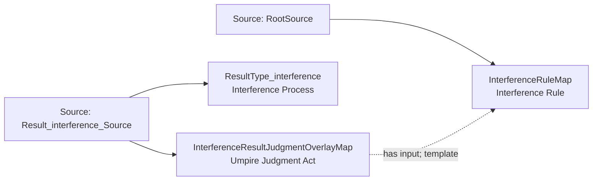

<!-- Generated by scripts/generate_rml_mermaid.py; do not edit. -->
<!-- Mapping SHA-256: f1f0054989fa91a76b8aa21a857f8b08cdeea24a88177e68a5ec0bb7ad0c493e -->

# Interference result - MLB game RML

A catcher-interference result carries an umpire judgment using the interference rule.

Solid relation arrows are explicit parent-triples-map joins. Dotted arrows match IRI templates or IRI-valued references within the same logical source. Cross-pattern targets are listed in the table rather than drawn. Unresolved dynamic resource types remain generic; the accepted design supplies their reviewed interpretation.

## Logical sources

| Source | Execution file | JSONPath iterator | Maps in this review |
| --- | --- | --- | ---: |
| `Result_interference_Source` | `game-context.json` | `$.liveData.plays.allPlays[?(@._baseballO.hasCompletedPlateAppearanceResult == true && @.result.eventType == 'catcher_interf')]` | 2 |
| `RootSource` | `game.json` | `$` | 1 |

## Triples maps

| Triples map | Subject class | Emitted relations | Cross-pattern targets |
| --- | --- | --- | --- |
| `ResultType_interference` | Interference Process | type assertion only | none |
| `InterferenceResultJudgmentOverlayMap` | Umpire Judgment Act | has input | none |
| `InterferenceRuleMap` | Interference Rule | type assertion only | none |
