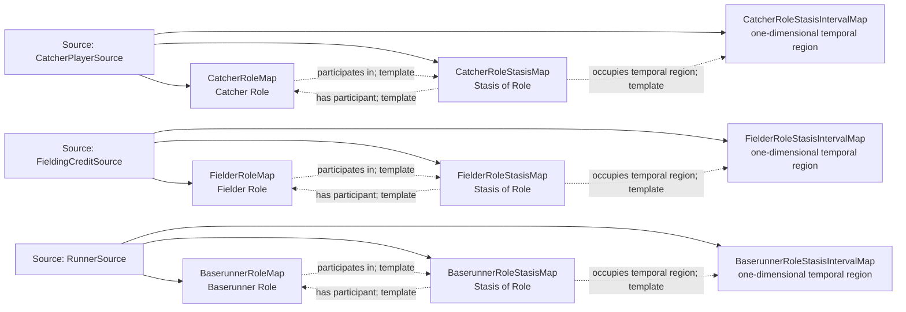

<!-- Generated by scripts/generate_rml_mermaid.py; do not edit. -->
<!-- Mapping SHA-256: 76b433db32acb7e8d69d7aeaabd0b6faa4e1973919c14b99d49047880065e471 -->

# Persistent fielding, catching, and baserunning roles - MLB game RML

Players bear persistent fielder, catcher, and baserunner roles whose open stases remain distinct from the players and roles.

Solid relation arrows are explicit parent-triples-map joins. Dotted relation arrows are IRI-template matches inferred by the reviewer from the actual RML templates. Cross-pattern targets are listed in the table rather than drawn, keeping the diagram small.

## Logical sources

| Source | Execution file | JSONPath iterator | Maps in this review |
| --- | --- | --- | ---: |
| `CatcherPlayerSource` | `game.json` | `$.gameData.players.*[?(@.primaryPosition.code == '2')]` | 3 |
| `FieldingCreditSource` | `game.json` | `$.liveData.plays.allPlays[*].runners[*].credits[*]` | 3 |
| `RunnerSource` | `game-context.json` | `$.liveData.plays.allPlays[*].runners[*]` | 3 |

## Triples maps

| Triples map | Subject class | Emitted relations | Cross-pattern targets |
| --- | --- | --- | --- |
| `BaserunnerRoleMap` | Baserunner Role | inheres in, participates in | inheres in -> Player (template) |
| `BaserunnerRoleStasisMap` | Stasis of Role | has participant, occupies temporal region | has participant -> Player (template) |
| `BaserunnerRoleStasisIntervalMap` | one-dimensional temporal region | type assertion only | none |
| `FielderRoleMap` | Fielder Role | inheres in, participates in | inheres in -> Player (template) |
| `FielderRoleStasisMap` | Stasis of Role | has participant, occupies temporal region | has participant -> Player (template) |
| `FielderRoleStasisIntervalMap` | one-dimensional temporal region | type assertion only | none |
| `CatcherRoleMap` | Catcher Role | inheres in, participates in | inheres in -> PlayerMap (template) |
| `CatcherRoleStasisMap` | Stasis of Role | has participant, occupies temporal region | has participant -> PlayerMap (template) |
| `CatcherRoleStasisIntervalMap` | one-dimensional temporal region | type assertion only | none |
