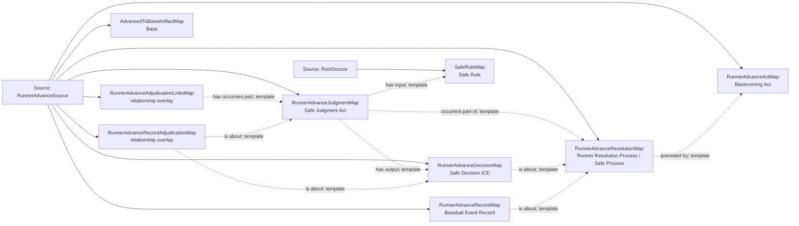

<!-- Generated by scripts/generate_rml_mermaid.py; do not edit. -->
<!-- Mapping SHA-256: 76b433db32acb7e8d69d7aeaabd0b6faa4e1973919c14b99d49047880065e471 -->

# Runner advances between bases - MLB game RML

A baserunning act precedes an institutional safe resolution with judgment, decision, destination-base artifact, and record; movement.end does not assert physical base touching.

Solid relation arrows are explicit parent-triples-map joins. Dotted relation arrows are IRI-template matches inferred by the reviewer from the actual RML templates. Cross-pattern targets are listed in the table rather than drawn, keeping the diagram small.

## Logical sources

| Source | Execution file | JSONPath iterator | Maps in this review |
| --- | --- | --- | ---: |
| `RootSource` | `game.json` | `$` | 1 |
| `RunnerAdvanceSource` | `game-context.json` | `$.liveData.plays.allPlays[*].runners[?(@.movement.isOut == false && @._baseballO.endsAtScore == false && @._baseballO.hasSupportedStartBase == true)]` | 8 |

## Triples maps

| Triples map | Subject class | Emitted relations | Cross-pattern targets |
| --- | --- | --- | --- |
| `RunnerAdvanceActMap` | Baserunning Act | has participant, occurrent part of, occurs at, realizes | has participant -> Player (template), occurrent part of -> Plate Appearance (template), occurs at -> Baseball Field (template), realizes -> BaserunnerRoleMap (template) |
| `RunnerAdvanceResolutionMap` | Runner Resolution Process, Safe Process | has participant, occurrent part of, occurs at, preceded by | has participant -> Player (template), occurrent part of -> Plate Appearance (template), occurs at -> Baseball Field (template) |
| `RunnerAdvanceJudgmentMap` | Safe Judgment Act | has input, has output, occurrent part of | none |
| `RunnerAdvanceDecisionMap` | Safe Decision ICE | is about | none |
| `RunnerAdvanceAdjudicationLinksMap` | relationship overlay | has occurrent part | none |
| `AdvancedToBaseArtifactMap` | Base | type assertion only | none |
| `RunnerAdvanceRecordMap` | Baseball Event Record | has text value, is about | none |
| `RunnerAdvanceRecordAdjudicationMap` | relationship overlay | is about | none |
| `SafeRuleMap` | Safe Rule | type assertion only | none |
