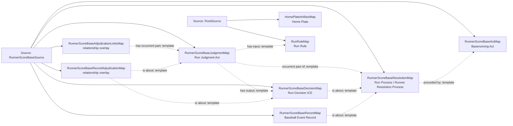

<!-- Generated by scripts/generate_rml_mermaid.py; do not edit. -->
<!-- Mapping SHA-256: 76b433db32acb7e8d69d7aeaabd0b6faa4e1973919c14b99d49047880065e471 -->

# Runner scores from a base - MLB game RML

A baserunning act from a base precedes an institutional run resolution with judgment, decision, and record; scoring does not by itself assert physical home-plate touching.

Solid relation arrows are explicit parent-triples-map joins. Dotted relation arrows are IRI-template matches inferred by the reviewer from the actual RML templates. Cross-pattern targets are listed in the table rather than drawn, keeping the diagram small.

## Logical sources

| Source | Execution file | JSONPath iterator | Maps in this review |
| --- | --- | --- | ---: |
| `RootSource` | `game.json` | `$` | 2 |
| `RunnerScoreBaseSource` | `game-context.json` | `$.liveData.plays.allPlays[*].runners[?(@.movement.isOut == false && @._baseballO.endsAtScore == true && @._baseballO.hasSupportedStartBase == true)]` | 7 |

## Triples maps

| Triples map | Subject class | Emitted relations | Cross-pattern targets |
| --- | --- | --- | --- |
| `RunnerScoreBaseActMap` | Baserunning Act | has participant, occurrent part of, occurs at, realizes | has participant -> Player (template), occurrent part of -> Plate Appearance (template), occurs at -> Baseball Field (template), realizes -> BaserunnerRoleMap (template) |
| `RunnerScoreBaseResolutionMap` | Run Process, Runner Resolution Process | has participant, occurrent part of, occurs at, preceded by | has participant -> Player (template), occurrent part of -> Plate Appearance (template), occurs at -> Baseball Field (template) |
| `RunnerScoreBaseJudgmentMap` | Run Judgment Act | has input, has output, occurrent part of | none |
| `RunnerScoreBaseDecisionMap` | Run Decision ICE | is about | none |
| `RunnerScoreBaseAdjudicationLinksMap` | relationship overlay | has occurrent part | none |
| `RunnerScoreBaseRecordMap` | Baseball Event Record | has text value, is about | none |
| `RunnerScoreBaseRecordAdjudicationMap` | relationship overlay | is about | none |
| `HomePlateArtifactMap` | Home Plate | type assertion only | none |
| `RunRuleMap` | Run Rule | type assertion only | none |
