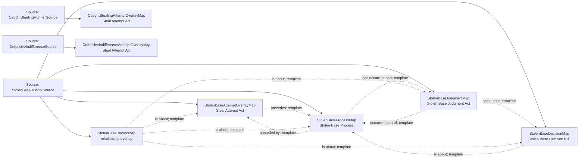

<!-- Generated by scripts/generate_rml_mermaid.py; do not edit. -->
<!-- Mapping SHA-256: 453de892549be95019b4529f875fbd86bd7bd073b32261dd717a096007cf3413 -->

# Stolen base and caught stealing - MLB game RML

A neutral steal-attempt act may support a distinct stolen-base process and adjudication; caught stealing retains the attempt without asserting success. Positively reconciled defensive-indifference running realizes the existing Steal Attempt pattern without a statistical stolen-base award.

Solid relation arrows are explicit parent-triples-map joins. Dotted arrows match IRI templates or IRI-valued references within the same logical source. Cross-pattern targets are listed in the table rather than drawn. Unresolved dynamic resource types remain generic; the accepted design supplies their reviewed interpretation.

## Logical sources

| Source | Execution file | JSONPath iterator | Maps in this review |
| --- | --- | --- | ---: |
| `CaughtStealingRunnerSource` | `game-context.json` | `$.liveData.plays.allPlays[*].runners[?(@.details.eventType == 'caught_stealing_2b' \|\| @.details.eventType == 'caught_stealing_3b' \|\| @.details.eventType == 'caught_stealing_home')]` | 1 |
| `DefensiveIndifferenceSource` | `game-context.json` | `$.liveData.plays.allPlays[*]._baseballO.defensiveIndifferenceActs[*]` | 1 |
| `StolenBaseRunnerSource` | `game-context.json` | `$.liveData.plays.allPlays[*].runners[?(@.details.eventType == 'stolen_base_2b' \|\| @.details.eventType == 'stolen_base_3b' \|\| @.details.eventType == 'stolen_base_home')]` | 5 |

## Triples maps

| Triples map | Subject class | Emitted relations | Cross-pattern targets |
| --- | --- | --- | --- |
| `StolenBaseAttemptOverlayMap` | Steal Attempt Act | precedes | none |
| `StolenBaseProcessMap` | Stolen Base Process | has occurrent part, has participant, occurrent part of, preceded by | has participant -> Player (template), occurrent part of -> Plate Appearance (template) |
| `StolenBaseJudgmentMap` | Stolen Base Judgment Act | has output, has participant, occurrent part of, realizes | has participant -> Person (template), realizes -> Official Scorer (template) |
| `StolenBaseDecisionMap` | Stolen Base Decision ICE | is about | none |
| `StolenBaseRecordMap` | relationship overlay | is about | none |
| `CaughtStealingAttemptOverlayMap` | Steal Attempt Act | type assertion only | none |
| `DefensiveIndifferenceAttemptOverlayMap` | Steal Attempt Act | type assertion only | none |
