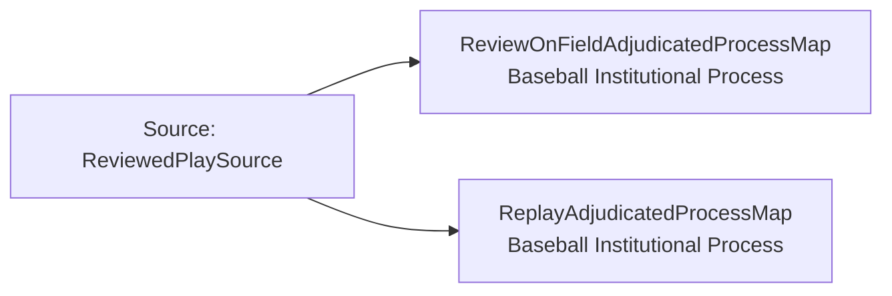

<!-- Generated by scripts/generate_rml_mermaid.py; do not edit. -->
<!-- Mapping SHA-256: ef70601419120731d914fe59980ec1dbefa4ce070f2bbca8ce5b46dbea3cb112 -->

# Replay adjudicated-process contexts - MLB game RML

The reviewed on-field judgment and replay-review act each belong to a distinct institutional process that is the subject of the corresponding decision.

Solid relation arrows are explicit parent-triples-map joins. Dotted relation arrows are IRI-template matches inferred by the reviewer from the actual RML templates. Cross-pattern targets are listed in the table rather than drawn, keeping the diagram small.

## Logical sources

| Source | Execution file | JSONPath iterator | Maps in this review |
| --- | --- | --- | ---: |
| `ReviewedPlaySource` | `game-context.json` | `$.liveData.plays.allPlays[?(@._baseballO.hasReview == true)]` | 2 |

## Triples maps

| Triples map | Subject class | Emitted relations | Cross-pattern targets |
| --- | --- | --- | --- |
| `ReviewOnFieldAdjudicatedProcessMap` | Baseball Institutional Process | has occurrent part | has occurrent part -> ReviewOnFieldJudgmentMap (template) |
| `ReplayAdjudicatedProcessMap` | Baseball Institutional Process | has occurrent part | has occurrent part -> ChallengedReplayReviewActMap (template) |
