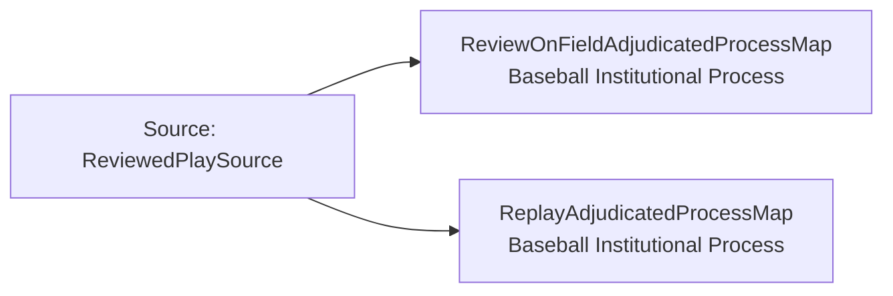

<!-- Generated by scripts/generate_rml_mermaid.py; do not edit. -->
<!-- Mapping SHA-256: bed3f052e82a896b8529c67b8e2a5c9746b06eef0788276d70bec48335fb63a4 -->

# Replay adjudicated-process contexts - MLB game RML

The reviewed on-field judgment and replay-review act each belong to a distinct institutional process that is the subject of the corresponding decision.

Solid relation arrows are explicit parent-triples-map joins. Dotted arrows match IRI templates or IRI-valued references within the same logical source. Cross-pattern targets are listed in the table rather than drawn. Unresolved dynamic resource types remain generic; the accepted design supplies their reviewed interpretation.

## Logical sources

| Source | Execution file | JSONPath iterator | Maps in this review |
| --- | --- | --- | ---: |
| `ReviewedPlaySource` | `game-context.json` | `$.liveData.plays.allPlays[?(@._baseballO.hasReview == true)]` | 2 |

## Triples maps

| Triples map | Subject class | Emitted relations | Cross-pattern targets |
| --- | --- | --- | --- |
| `ReviewOnFieldAdjudicatedProcessMap` | Baseball Institutional Process | has occurrent part | has occurrent part -> ReviewOnFieldJudgmentMap (template) |
| `ReplayAdjudicatedProcessMap` | Baseball Institutional Process | has occurrent part | has occurrent part -> ChallengedReplayReviewActMap (template) |
