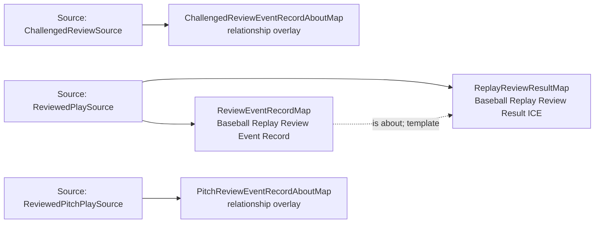

<!-- Generated by scripts/generate_rml_mermaid.py; do not edit. -->
<!-- Mapping SHA-256: ef70601419120731d914fe59980ec1dbefa4ce070f2bbca8ce5b46dbea3cb112 -->

# Replay review result and record - MLB game RML

Review-result information describes the relationship between the two decisions, while a source event record is about the full review pattern, an optional challenge, and the final structured outcome.

Solid relation arrows are explicit parent-triples-map joins. Dotted relation arrows are IRI-template matches inferred by the reviewer from the actual RML templates. Cross-pattern targets are listed in the table rather than drawn, keeping the diagram small.

## Logical sources

| Source | Execution file | JSONPath iterator | Maps in this review |
| --- | --- | --- | ---: |
| `ChallengedReviewSource` | `game-context.json` | `$.liveData.plays.allPlays[?(@._baseballO.reviewInitiation == 'challenge')]` | 1 |
| `ReviewedPitchPlaySource` | `game-context.json` | `$.liveData.plays.allPlays[?(@._baseballO.reviewType == 'pitch_result')]` | 1 |
| `ReviewedPlaySource` | `game-context.json` | `$.liveData.plays.allPlays[?(@._baseballO.hasReview == true)]` | 2 |

## Triples maps

| Triples map | Subject class | Emitted relations | Cross-pattern targets |
| --- | --- | --- | --- |
| `ReplayReviewResultMap` | Baseball Replay Review Result ICE | is about, is output of | is about -> ReplayDecisionMap (template), is about -> ReviewOnFieldDecisionMap (template), is output of -> ChallengedReplayReviewActMap (template) |
| `ReviewEventRecordMap` | Baseball Replay Review Event Record | has text value, is about | is about -> BalkResultJudgmentOverlayMap (template), is about -> ChallengedReplayReviewActMap (template), is about -> ReplayDecisionMap (template), is about -> ReviewOnFieldDecisionMap (template), is about -> ReviewOnFieldJudgmentMap (template) |
| `ChallengedReviewEventRecordAboutMap` | relationship overlay | is about | is about -> ReviewChallengeMap (template) |
| `PitchReviewEventRecordAboutMap` | relationship overlay | is about | is about -> Pitch (template) |
