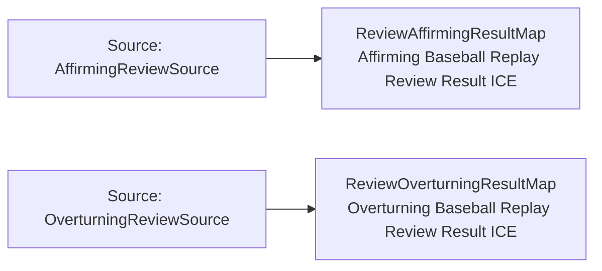

<!-- Generated by scripts/generate_rml_mermaid.py; do not edit. -->
<!-- Mapping SHA-256: 0525c6bf4b5afe22d7f8ed5ae6ba27fe96831e3a0765c0c3bf5a615539bc1189 -->

# Replay review result classification - MLB game RML

Review-result information is classified as affirming or overturning from the source review outcome.

Solid relation arrows are explicit parent-triples-map joins. Dotted arrows match IRI templates or IRI-valued references within the same logical source. Cross-pattern targets are listed in the table rather than drawn. Unresolved dynamic resource types remain generic; the accepted design supplies their reviewed interpretation.

## Logical sources

| Source | Execution file | JSONPath iterator | Maps in this review |
| --- | --- | --- | ---: |
| `AffirmingReviewSource` | `game-context.json` | `$.liveData.plays.allPlays[?(@._baseballO.reviewOutcome == 'affirming')]` | 1 |
| `OverturningReviewSource` | `game-context.json` | `$.liveData.plays.allPlays[?(@._baseballO.reviewOutcome == 'overturning')]` | 1 |

## Triples maps

| Triples map | Subject class | Emitted relations | Cross-pattern targets |
| --- | --- | --- | --- |
| `ReviewAffirmingResultMap` | Affirming Baseball Replay Review Result ICE | type assertion only | none |
| `ReviewOverturningResultMap` | Overturning Baseball Replay Review Result ICE | type assertion only | none |
