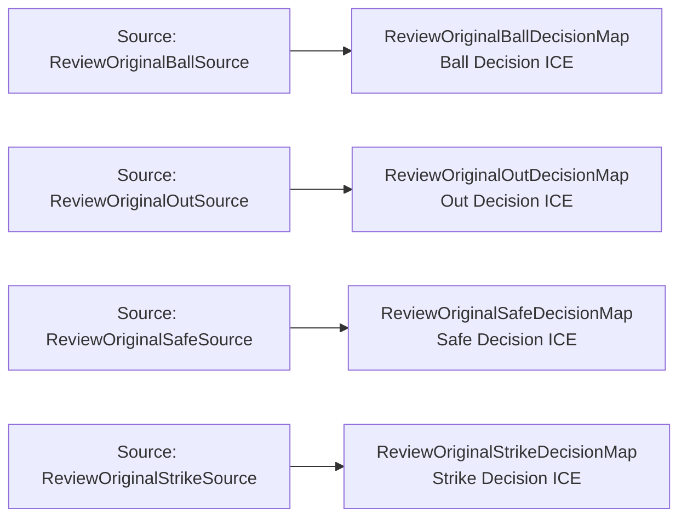

<!-- Generated by scripts/generate_rml_mermaid.py; do not edit. -->
<!-- Mapping SHA-256: a67dbfc25c191c8b89cbb9a38b4e3a3f348374e37180679a6c7c99f69e4088a9 -->

# Reviewed on-field decision classification - MLB game RML

The reviewed on-field decision is classified as ball, strike, out, or safe when the source supports one of those alternatives.

Solid relation arrows are explicit parent-triples-map joins. Dotted arrows match IRI templates or IRI-valued references within the same logical source. Cross-pattern targets are listed in the table rather than drawn. Unresolved dynamic resource types remain generic; the accepted design supplies their reviewed interpretation.

## Logical sources

| Source | Execution file | JSONPath iterator | Maps in this review |
| --- | --- | --- | ---: |
| `ReviewOriginalBallSource` | `game-context.json` | `$.liveData.plays.allPlays[?(@._baseballO.reviewOriginalDecision == 'ball')]` | 1 |
| `ReviewOriginalOutSource` | `game-context.json` | `$.liveData.plays.allPlays[?(@._baseballO.reviewOriginalDecision == 'out')]` | 1 |
| `ReviewOriginalSafeSource` | `game-context.json` | `$.liveData.plays.allPlays[?(@._baseballO.reviewOriginalDecision == 'safe')]` | 1 |
| `ReviewOriginalStrikeSource` | `game-context.json` | `$.liveData.plays.allPlays[?(@._baseballO.reviewOriginalDecision == 'strike')]` | 1 |

## Triples maps

| Triples map | Subject class | Emitted relations | Cross-pattern targets |
| --- | --- | --- | --- |
| `ReviewOriginalBallDecisionMap` | Ball Decision ICE | type assertion only | none |
| `ReviewOriginalStrikeDecisionMap` | Strike Decision ICE | type assertion only | none |
| `ReviewOriginalOutDecisionMap` | Out Decision ICE | type assertion only | none |
| `ReviewOriginalSafeDecisionMap` | Safe Decision ICE | type assertion only | none |
