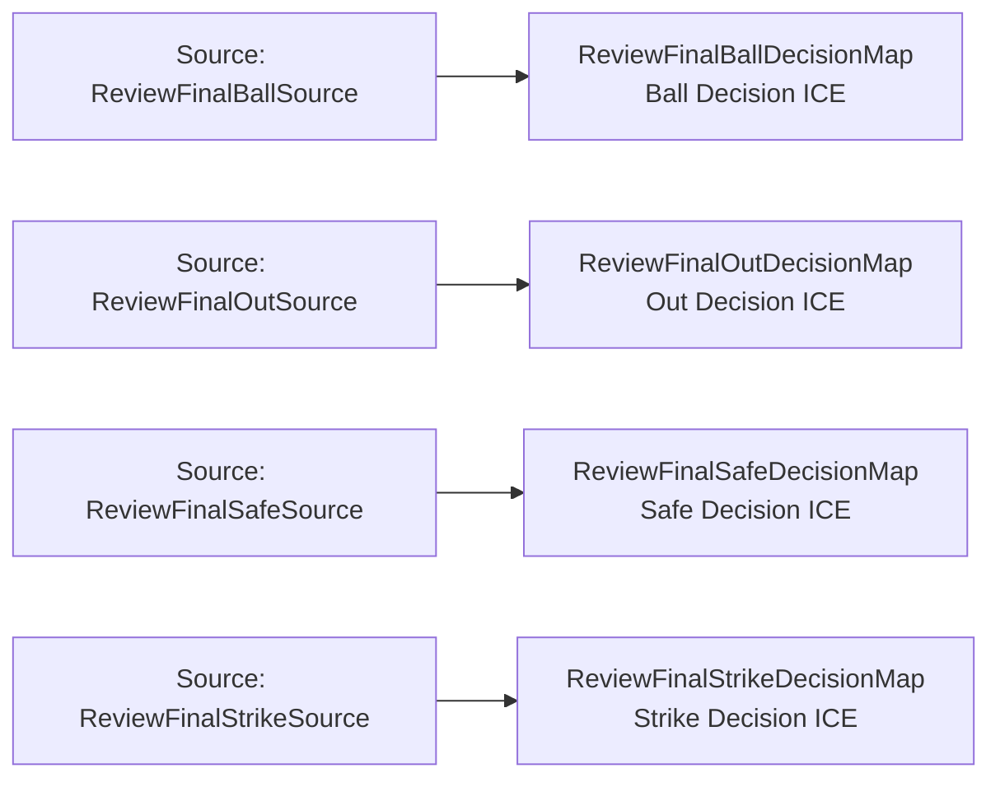

<!-- Generated by scripts/generate_rml_mermaid.py; do not edit. -->
<!-- Mapping SHA-256: 897a41688f0cd36aa8d0b3a8112c132b2c4a4f3e779505192f51b33870df8cea -->

# Replay decision classification - MLB game RML

The replay decision is classified as ball, strike, out, or safe from the final structured source state.

Solid relation arrows are explicit parent-triples-map joins. Dotted relation arrows are IRI-template matches inferred by the reviewer from the actual RML templates. Cross-pattern targets are listed in the table rather than drawn, keeping the diagram small.

## Logical sources

| Source | Execution file | JSONPath iterator | Maps in this review |
| --- | --- | --- | ---: |
| `ReviewFinalBallSource` | `game-context.json` | `$.liveData.plays.allPlays[?(@._baseballO.reviewFinalDecision == 'ball')]` | 1 |
| `ReviewFinalOutSource` | `game-context.json` | `$.liveData.plays.allPlays[?(@._baseballO.reviewFinalDecision == 'out')]` | 1 |
| `ReviewFinalSafeSource` | `game-context.json` | `$.liveData.plays.allPlays[?(@._baseballO.reviewFinalDecision == 'safe')]` | 1 |
| `ReviewFinalStrikeSource` | `game-context.json` | `$.liveData.plays.allPlays[?(@._baseballO.reviewFinalDecision == 'strike')]` | 1 |

## Triples maps

| Triples map | Subject class | Emitted relations | Cross-pattern targets |
| --- | --- | --- | --- |
| `ReviewFinalBallDecisionMap` | Ball Decision ICE | type assertion only | none |
| `ReviewFinalStrikeDecisionMap` | Strike Decision ICE | type assertion only | none |
| `ReviewFinalOutDecisionMap` | Out Decision ICE | type assertion only | none |
| `ReviewFinalSafeDecisionMap` | Safe Decision ICE | type assertion only | none |
