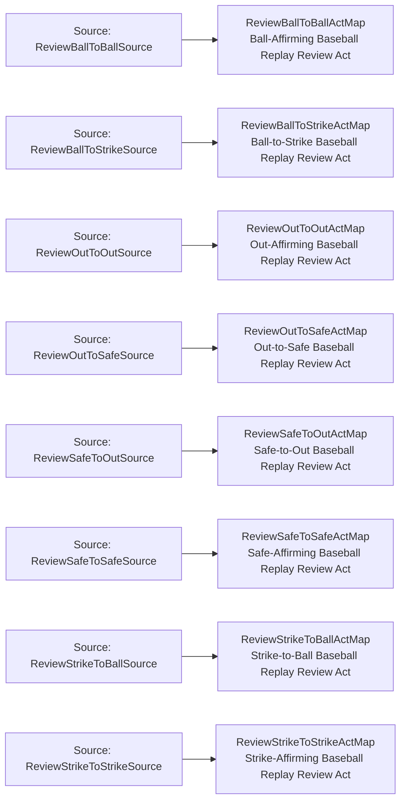

<!-- Generated by scripts/generate_rml_mermaid.py; do not edit. -->
<!-- Mapping SHA-256: ef70601419120731d914fe59980ec1dbefa4ce070f2bbca8ce5b46dbea3cb112 -->

# Replay review transition patterns - MLB game RML

Each replay-review act receives one explicit ball-to-ball, strike-to-strike, out-to-out, safe-to-safe, ball-to-strike, strike-to-ball, out-to-safe, or safe-to-out classification when the source supports it.

Solid relation arrows are explicit parent-triples-map joins. Dotted relation arrows are IRI-template matches inferred by the reviewer from the actual RML templates. Cross-pattern targets are listed in the table rather than drawn, keeping the diagram small.

## Logical sources

| Source | Execution file | JSONPath iterator | Maps in this review |
| --- | --- | --- | ---: |
| `ReviewBallToBallSource` | `game-context.json` | `$.liveData.plays.allPlays[?(@._baseballO.reviewPattern == 'ball_to_ball')]` | 1 |
| `ReviewBallToStrikeSource` | `game-context.json` | `$.liveData.plays.allPlays[?(@._baseballO.reviewPattern == 'ball_to_strike')]` | 1 |
| `ReviewOutToOutSource` | `game-context.json` | `$.liveData.plays.allPlays[?(@._baseballO.reviewPattern == 'out_to_out')]` | 1 |
| `ReviewOutToSafeSource` | `game-context.json` | `$.liveData.plays.allPlays[?(@._baseballO.reviewPattern == 'out_to_safe')]` | 1 |
| `ReviewSafeToOutSource` | `game-context.json` | `$.liveData.plays.allPlays[?(@._baseballO.reviewPattern == 'safe_to_out')]` | 1 |
| `ReviewSafeToSafeSource` | `game-context.json` | `$.liveData.plays.allPlays[?(@._baseballO.reviewPattern == 'safe_to_safe')]` | 1 |
| `ReviewStrikeToBallSource` | `game-context.json` | `$.liveData.plays.allPlays[?(@._baseballO.reviewPattern == 'strike_to_ball')]` | 1 |
| `ReviewStrikeToStrikeSource` | `game-context.json` | `$.liveData.plays.allPlays[?(@._baseballO.reviewPattern == 'strike_to_strike')]` | 1 |

## Triples maps

| Triples map | Subject class | Emitted relations | Cross-pattern targets |
| --- | --- | --- | --- |
| `ReviewBallToBallActMap` | Ball-Affirming Baseball Replay Review Act | type assertion only | none |
| `ReviewStrikeToStrikeActMap` | Strike-Affirming Baseball Replay Review Act | type assertion only | none |
| `ReviewOutToOutActMap` | Out-Affirming Baseball Replay Review Act | type assertion only | none |
| `ReviewSafeToSafeActMap` | Safe-Affirming Baseball Replay Review Act | type assertion only | none |
| `ReviewBallToStrikeActMap` | Ball-to-Strike Baseball Replay Review Act | type assertion only | none |
| `ReviewStrikeToBallActMap` | Strike-to-Ball Baseball Replay Review Act | type assertion only | none |
| `ReviewOutToSafeActMap` | Out-to-Safe Baseball Replay Review Act | type assertion only | none |
| `ReviewSafeToOutActMap` | Safe-to-Out Baseball Replay Review Act | type assertion only | none |
