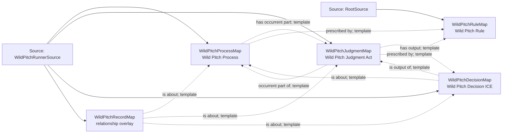

<!-- Generated by scripts/generate_rml_mermaid.py; do not edit. -->
<!-- Mapping SHA-256: 897a41688f0cd36aa8d0b3a8112c132b2c4a4f3e779505192f51b33870df8cea -->

# Wild-pitch scoring classification - MLB game RML

A wild pitch is an institutional scorer judgment, decision, rule, and counted process; the feed does not independently establish a physical pitch-ball control failure.

Solid relation arrows are explicit parent-triples-map joins. Dotted relation arrows are IRI-template matches inferred by the reviewer from the actual RML templates. Cross-pattern targets are listed in the table rather than drawn, keeping the diagram small.

## Logical sources

| Source | Execution file | JSONPath iterator | Maps in this review |
| --- | --- | --- | ---: |
| `RootSource` | `game.json` | `$` | 1 |
| `WildPitchRunnerSource` | `game-context.json` | `$.liveData.plays.allPlays[*].runners[?(@.details.eventType == 'wild_pitch')]` | 4 |

## Triples maps

| Triples map | Subject class | Emitted relations | Cross-pattern targets |
| --- | --- | --- | --- |
| `WildPitchProcessMap` | Wild Pitch Process | has occurrent part, occurrent part of, prescribed by | occurrent part of -> Plate Appearance (template) |
| `WildPitchJudgmentMap` | Wild Pitch Judgment Act | has output, has participant, occurrent part of, prescribed by, realizes | has participant -> Person (template), realizes -> Official Scorer (template) |
| `WildPitchDecisionMap` | Wild Pitch Decision ICE | is about, is output of | none |
| `WildPitchRecordMap` | relationship overlay | is about | none |
| `WildPitchRuleMap` | Wild Pitch Rule | type assertion only | none |
