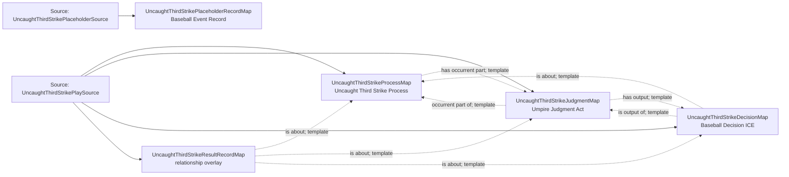

<!-- Generated by scripts/generate_rml_mermaid.py; do not edit. -->
<!-- Mapping SHA-256: 01f3efbccd0d2691d2b9ea22d2976ccca3e092a05a923e48639427281ac4ce8b -->

# Uncaught third strike and unresolved source placeholder - MLB game RML

An uncaught third strike contains the strikeout and its own adjudication while MLB's null runner row remains an event record rather than becoming a fabricated physical failure, movement, or resolution.

Solid relation arrows are explicit parent-triples-map joins. Dotted relation arrows are IRI-template matches inferred by the reviewer from the actual RML templates. Cross-pattern targets are listed in the table rather than drawn, keeping the diagram small.

## Logical sources

| Source | Execution file | JSONPath iterator | Maps in this review |
| --- | --- | --- | ---: |
| `UncaughtThirdStrikePlaceholderSource` | `game-context.json` | `$.liveData.plays.allPlays[*].runners[?(@._baseballO.isUncaughtThirdStrikePlaceholder == true)]` | 1 |
| `UncaughtThirdStrikePlaySource` | `game-context.json` | `$.liveData.plays.allPlays[?(@._baseballO.isUncaughtThirdStrike == true)]` | 4 |

## Triples maps

| Triples map | Subject class | Emitted relations | Cross-pattern targets |
| --- | --- | --- | --- |
| `UncaughtThirdStrikeProcessMap` | Uncaught Third Strike Process | has occurrent part, occurrent part of, prescribed by | has occurrent part -> PlateAppearanceResultMap (template), occurrent part of -> PlateAppearanceMap (template), prescribed by -> StrikeRuleMap (template) |
| `UncaughtThirdStrikeJudgmentMap` | Umpire Judgment Act | has output, has participant, occurrent part of, prescribed by, realizes | has participant -> Person (template), prescribed by -> StrikeRuleMap (template), realizes -> Umpire (template) |
| `UncaughtThirdStrikeDecisionMap` | Baseball Decision ICE | is about, is output of | none |
| `UncaughtThirdStrikeResultRecordMap` | relationship overlay | is about | none |
| `UncaughtThirdStrikePlaceholderRecordMap` | Baseball Event Record | has text value, is about | is about -> Uncaught Third Strike (template) |
