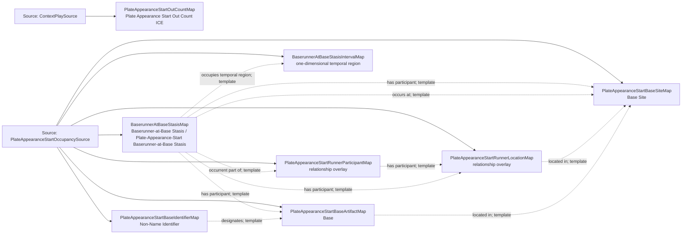

<!-- Generated by scripts/generate_rml_mermaid.py; do not edit. -->
<!-- Mapping SHA-256: eb537822e4bab673851aa84bf233b33843d82c93e6cce031fecfd402d6c46950 -->

# Plate appearance start state - MLB game RML

Each plate appearance records its starting out count; every occupied base contributes a runner participant, a base-scoped stasis, the physical Base, and the corresponding Base Site.

Solid relation arrows are explicit parent-triples-map joins. Dotted arrows match IRI templates or IRI-valued references within the same logical source. Cross-pattern targets are listed in the table rather than drawn. Unresolved dynamic resource types remain generic; the accepted design supplies their reviewed interpretation.

## Logical sources

| Source | Execution file | JSONPath iterator | Maps in this review |
| --- | --- | --- | ---: |
| `ContextPlaySource` | `game-context.json` | `$.liveData.plays.allPlays[?(@._baseballO.hasPlateAppearanceStructure == true)]` | 1 |
| `PlateAppearanceStartOccupancySource` | `game-context.json` | `$.liveData.plays.allPlays[*]._baseballO.startBaseOccupancies[*]` | 7 |

## Triples maps

| Triples map | Subject class | Emitted relations | Cross-pattern targets |
| --- | --- | --- | --- |
| `PlateAppearanceStartOutCountMap` | Plate Appearance Start Out Count ICE | has integer value, is about | is about -> PlateAppearanceMap (template) |
| `PlateAppearanceStartRunnerParticipantMap` | relationship overlay | has participant | none |
| `BaserunnerAtBaseStasisMap` | Baserunner-at-Base Stasis, Plate-Appearance-Start Baserunner-at-Base Stasis | has participant, occupies temporal region, occurrent part of, occurs at | none |
| `BaserunnerAtBaseStasisIntervalMap` | one-dimensional temporal region | has first instant, temporal part of | has first instant -> Start (template), temporal part of -> Temporal Interval (template) |
| `PlateAppearanceStartRunnerLocationMap` | relationship overlay | located in | none |
| `PlateAppearanceStartBaseArtifactMap` | Base | label, located in | none |
| `PlateAppearanceStartBaseIdentifierMap` | Non-Name Identifier | designates, has text value | none |
| `PlateAppearanceStartBaseSiteMap` | Base Site | continuant part of, label | continuant part of -> Baseball Field (template) |
