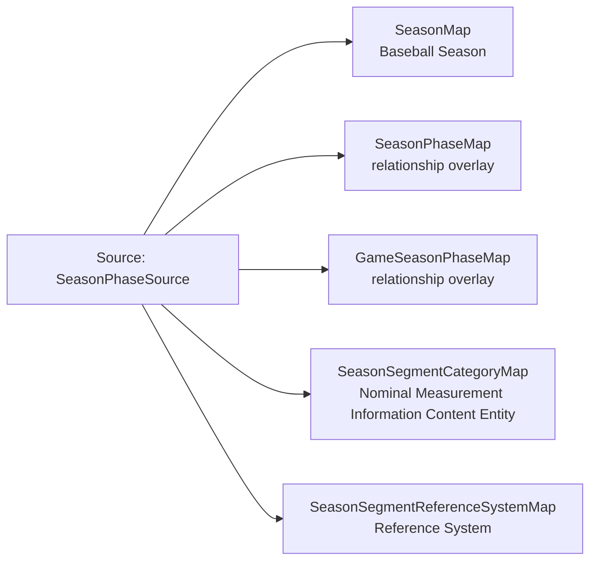

<!-- Generated by scripts/generate_rml_mermaid.py; do not edit. -->
<!-- Mapping SHA-256: 55c45ecc9df86d579681cfa026c088b432d3de03bbb7b6183ebb6c6fdd04c5dd -->

# Season and season phase - MLB game RML

A game is an occurrent part of a reviewed season phase, the phase is an occurrent part of its season, and the provider category remains nominal evidence in a versioned Reference System.

Solid relation arrows are explicit parent-triples-map joins. Dotted relation arrows are IRI-template matches inferred by the reviewer from the actual RML templates. Cross-pattern targets are listed in the table rather than drawn, keeping the diagram small.

## Logical sources

| Source | Execution file | JSONPath iterator | Maps in this review |
| --- | --- | --- | ---: |
| `SeasonPhaseSource` | `game-context.json` | `$._baseballO.seasonPhase` | 5 |

## Triples maps

| Triples map | Subject class | Emitted relations | Cross-pattern targets |
| --- | --- | --- | --- |
| `SeasonMap` | Baseball Season | has occurrent part | none |
| `SeasonPhaseMap` | relationship overlay | has occurrent part, is measured by nominal, occurrent part of, type | none |
| `GameSeasonPhaseMap` | relationship overlay | occurrent part of | none |
| `SeasonSegmentCategoryMap` | Nominal Measurement Information Content Entity | uses reference system | none |
| `SeasonSegmentReferenceSystemMap` | Reference System | label | none |
