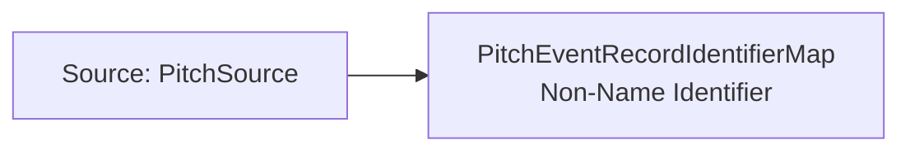

<!-- Generated by scripts/generate_rml_mermaid.py; do not edit. -->
<!-- Mapping SHA-256: f1f0054989fa91a76b8aa21a857f8b08cdeea24a88177e68a5ec0bb7ad0c493e -->

# Pitch event-record identifier - MLB game RML

A playId Identifier ICE designates the MLB pitch event-record ICE and carries the source value; the record remains about the real-world pitch and related evidence.

Solid relation arrows are explicit parent-triples-map joins. Dotted arrows match IRI templates or IRI-valued references within the same logical source. Cross-pattern targets are listed in the table rather than drawn. Unresolved dynamic resource types remain generic; the accepted design supplies their reviewed interpretation.

## Logical sources

| Source | Execution file | JSONPath iterator | Maps in this review |
| --- | --- | --- | ---: |
| `PitchSource` | `game-context.json` | `$.liveData.plays.allPlays[*].playEvents[?(@.isPitch == true)]` | 1 |

## Triples maps

| Triples map | Subject class | Emitted relations | Cross-pattern targets |
| --- | --- | --- | --- |
| `PitchEventRecordIdentifierMap` | Non-Name Identifier | designates, has text value | designates -> PitchEventRecordMap (template) |
