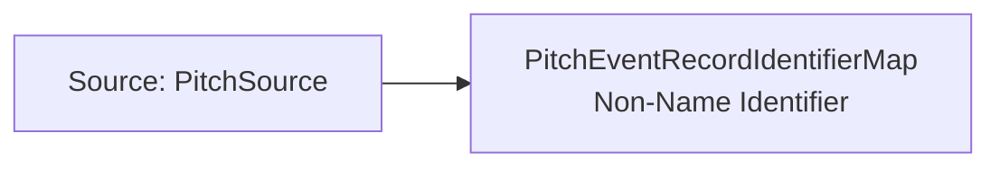

<!-- Generated by scripts/generate_rml_mermaid.py; do not edit. -->
<!-- Mapping SHA-256: 897a41688f0cd36aa8d0b3a8112c132b2c4a4f3e779505192f51b33870df8cea -->

# Pitch event-record identifier - MLB game RML

A playId Identifier ICE designates the MLB pitch event-record ICE and carries the source value; the record remains about the real-world pitch and related evidence.

Solid relation arrows are explicit parent-triples-map joins. Dotted relation arrows are IRI-template matches inferred by the reviewer from the actual RML templates. Cross-pattern targets are listed in the table rather than drawn, keeping the diagram small.

## Logical sources

| Source | Execution file | JSONPath iterator | Maps in this review |
| --- | --- | --- | ---: |
| `PitchSource` | `game-context.json` | `$.liveData.plays.allPlays[*].playEvents[?(@.isPitch == true)]` | 1 |

## Triples maps

| Triples map | Subject class | Emitted relations | Cross-pattern targets |
| --- | --- | --- | --- |
| `PitchEventRecordIdentifierMap` | Non-Name Identifier | designates, has text value | designates -> PitchEventRecordMap (template) |
