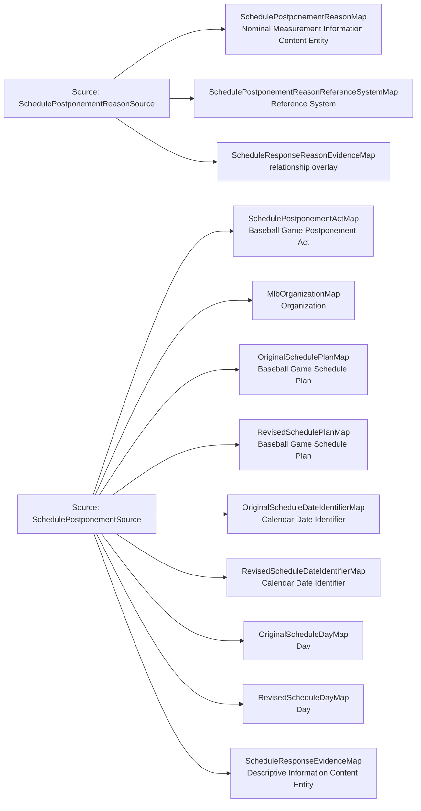

<!-- Generated by scripts/generate_rml_mermaid.py; do not edit. -->
<!-- Mapping SHA-256: 55c45ecc9df86d579681cfa026c088b432d3de03bbb7b6183ebb6c6fdd04c5dd -->

# Game postponement and schedule revision - MLB game RML

An official MLB declaration consumes an old game Schedule Plan and produces a distinct later Plan for the same game; Calendar Date Identifiers designate canonical Days, while the provider reason remains nominal evidence rather than an asserted weather cause.

Solid relation arrows are explicit parent-triples-map joins. Dotted relation arrows are IRI-template matches inferred by the reviewer from the actual RML templates. Cross-pattern targets are listed in the table rather than drawn, keeping the diagram small.

## Logical sources

| Source | Execution file | JSONPath iterator | Maps in this review |
| --- | --- | --- | ---: |
| `SchedulePostponementReasonSource` | `game-context.json` | `$._baseballO.schedulePostponements[?(@.hasReason == true)]` | 3 |
| `SchedulePostponementSource` | `game-context.json` | `$._baseballO.schedulePostponements[*]` | 9 |

## Triples maps

| Triples map | Subject class | Emitted relations | Cross-pattern targets |
| --- | --- | --- | --- |
| `SchedulePostponementActMap` | Baseball Game Postponement Act | has agent, has input, has output | none |
| `MlbOrganizationMap` | Organization | label | none |
| `OriginalSchedulePlanMap` | Baseball Game Schedule Plan | has continuant part, prescribes | none |
| `RevisedSchedulePlanMap` | Baseball Game Schedule Plan | has continuant part, prescribes | none |
| `OriginalScheduleDateIdentifierMap` | Calendar Date Identifier | designates, has date value | none |
| `RevisedScheduleDateIdentifierMap` | Calendar Date Identifier | designates, has date value | none |
| `OriginalScheduleDayMap` | Day | precedes | none |
| `RevisedScheduleDayMap` | Day | type assertion only | none |
| `SchedulePostponementReasonMap` | Nominal Measurement Information Content Entity | has text value, is a measurement of, uses reference system | none |
| `SchedulePostponementReasonReferenceSystemMap` | Reference System | label | none |
| `ScheduleResponseEvidenceMap` | Descriptive Information Content Entity | has continuant part, is about | none |
| `ScheduleResponseReasonEvidenceMap` | relationship overlay | has continuant part | none |
