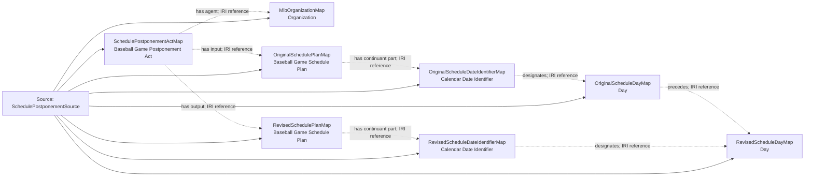

<!-- Generated by scripts/generate_rml_mermaid.py; do not edit. -->
<!-- Mapping SHA-256: 8c345042ecb2958d80d8fed5ce06613c31a202b499d928f3fbad5f6be2d4170c -->

# Game postponement and schedule revision - MLB game RML

An official MLB declaration consumes an old game Schedule Plan and produces a distinct later Plan for the same game; Calendar Date Identifiers designate canonical Days, while the provider reason remains nominal evidence rather than an asserted weather cause.

Solid relation arrows are explicit parent-triples-map joins. Dotted arrows match IRI templates or IRI-valued references within the same logical source. Cross-pattern targets are listed in the table rather than drawn. Unresolved dynamic resource types remain generic; the accepted design supplies their reviewed interpretation.

## Logical sources

| Source | Execution file | JSONPath iterator | Maps in this review |
| --- | --- | --- | ---: |
| `SchedulePostponementSource` | `game-context.json` | `$._baseballO.schedulePostponements[*]` | 8 |

## Triples maps

| Triples map | Subject class | Emitted relations | Cross-pattern targets |
| --- | --- | --- | --- |
| `SchedulePostponementActMap` | Baseball Game Postponement Act | has agent, has input, has output | none |
| `MlbOrganizationMap` | Organization | label | none |
| `OriginalSchedulePlanMap` | Baseball Game Schedule Plan | has continuant part, prescribes | prescribes -> Referenced resource (IRI reference) |
| `RevisedSchedulePlanMap` | Baseball Game Schedule Plan | has continuant part, prescribes | prescribes -> Referenced resource (IRI reference) |
| `OriginalScheduleDateIdentifierMap` | Calendar Date Identifier | designates, has date value | none |
| `RevisedScheduleDateIdentifierMap` | Calendar Date Identifier | designates, has date value | none |
| `OriginalScheduleDayMap` | Day | precedes | none |
| `RevisedScheduleDayMap` | Day | type assertion only | none |
